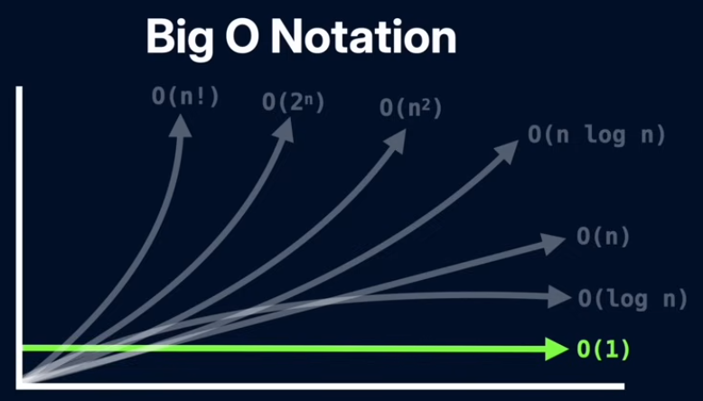
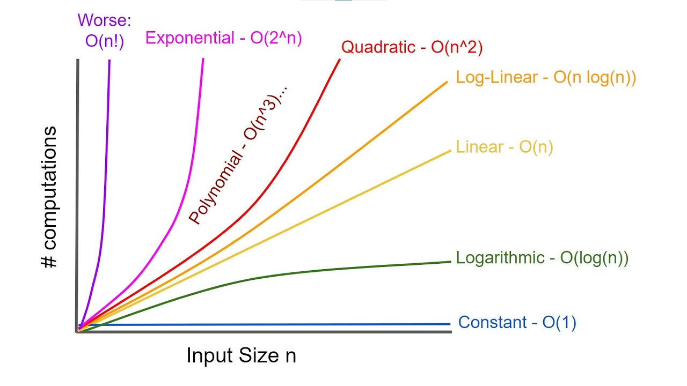

---
title: "Time and Space Complexity"
date: "2025-11-14"
categories: ["Computer Science"]
--- 

## Introduction
In computer science, time and space complexity are measures of how an algorithm's performance scales with the size of its input. Both are typically described using Big O notation, e.g., $O(1)$ or $O(n)$, to describe their worst-case behaviour as the input size increases.

## Big O Notation
**Big O notation** is a mathematical way to describe the efficiency of an algorithm by expressing how its performance, specifically its running time or space requriements, grows as the input size $n$ increases. It provides an upper bound for the worst-case scenario, and is used to compare algorithms and understand their scalability.

The best possible complexity is $O(1)$, **constant**, meaning that the algorithm takes the same amount of time regardless of input size (e.g., accessing an element in an array by index). The worst possible complexity is $O(n!)$, **factorial**, wherein the complexity grows astronomically, making the algorithm impractical even for small input sizes.

## Time Complexity
**Time complexity** is defined as the amount of time an algorithm takes to run as a function of its input size; it quantifies the running time.

We can best understand how the runtime grows with the input by analyzing the number of operations, such as loops or function calls.

Some common examples: 

* $O(1)$: **constant time** (e.g., accessing an array element by index)
* $O(\textnormal{log}n)$: **logarithmic time** (e.g., a binary search, where search space is divided in half in each step)
* $O(n)$: **linear time** (e.g., iterating through an array once)
* $O(n^2)$: **quadratic time** (e.g., nested loops, as in a bubble sort)

## Space Complexity
**Space complexity** is defined as the amount of memory an algorithm uses as a function of its input size.

This can be understood by counting the number of variables, data structures, and other memory allocations. 

Some common examples: 

* $O(1)$: **constant space** (e.g., using a fixed number of variables)
* $O(n)$: **linear space** (e.g., creating an array of size $n$)
* $O(n^2)$: **quadratic space** (e.g., a 2D array of size $n \times n$)

## Takeaways
There is often a tradeoff between time and space. An algorithm that is faster in time may require more memory, and vice versa. The best choice of your algorithm depends on the specific problem, input size, and system constraints.