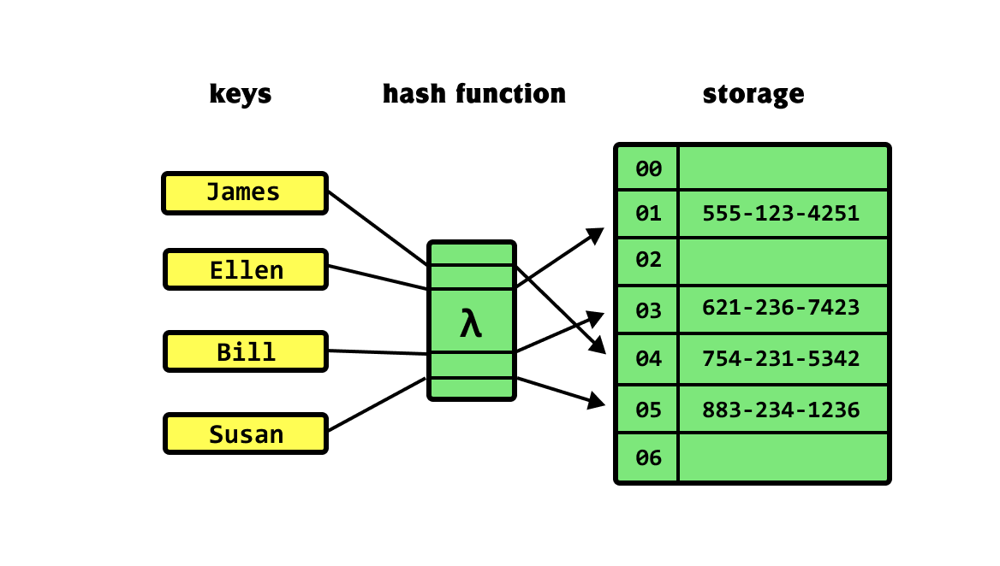

---
title: "Hash Tables"
date: "2025-11-16"
categories: ["Computer Science"]
--- 

## Introduction
A hash table, or hash map, is a data structure that can map keys to values. A hash table uses a hash function on an element to compute an index from which the desired value can be found. During lookup, the key is hashed, and the resulting hash indicates where the corresponding value is stored. 

Hashing is the most common example of a space-time tradeoff. Instead of linearly searching an array each time to determine if an element is present, we can traverse the array once, and hash all its elements into a hash table. Then, to determine whether the element is present just requires checking if it exists in the hash table, which is on average $O(1)$. 

In Python, hash tables are implemented via built-in dictionaries. 



## Time Complexity

| Operation | Complexity | Notes |
| :--- | :--: | :--- |
| search | $O(1)$ | on average |
| insert | $O(1)$ | on average |
| remove | $O(1)$ | on average |

## Example Problems

### Group Anagrams
Taken from [Neetcode's Group Anagrams](https://neetcode.io/problems/anagram-groups?list=neetcode150). 

Given an array of strings `strs`, group all anagrams together into sublists. You may return the output in any order.

An anagram is a string that contains the exact same characters as another string, but the order of the characters can be different.

> Example 1:
> 
> Input: `strs = ["act","pots","tops","cat","stop","hat"]`
> 
> Output: `[["hat"],["act", "cat"],["stop", "pots", "tops"]]`
> 
> Example 2:
> 
> Input: `strs = ["x"]`
> 
> Output: `[["x"]]`
> 
> Example 3:
> 
> Input: `strs = [""]`
> 
> Output: `[[""]]`

Recall that when it comes to anagrams, character order does not matter, so for each word, we only need to track character frequencies. 

A good way to track the information we need is via a hash map, where each key is a tuple of character frequencies, and the value is a list of anagrams with those same frequencies. 

A trick used in the following solution is mapping each lower case alphabetical character to an index between 0 and 25 via the `ord(char) - ord('a')`, where `ord` returns the ASCII/Unicode value of a character.

```python
def groupAnagrams(strs: List[str]) -> List[List[str]]:

    # initialize the counter hash map
    counter = {}

    # for each word, grab character freqs, and add the word 
    # to the corresponding value list
    for word in strs: 
        # start off w all zeros
        char_freqs = [0] * 26

        # for each char, modify the value in char_freqs
        for char in word: 
            # maps each char to an index in 0-25
            char_freqs[ord(char) - ord('a')] += 1

        # add the word to corresponding list
        # lists are unhashable, so convert to tuple
        key = tuple(char_freqs)
        if key in counter: 
            counter[key].append(word)
        else: 
            counter[key] = [word]
    
    return list(counter.values())

```

### Top K Most Frequent Elements
Taken from [Neetcode's Top K Frequent Elements](https://neetcode.io/problems/top-k-elements-in-list?list=neetcode150).

Given an integer array `nums` and an integer `k`, return the `k` most frequent elements within the array.

The test cases are generated such that the answer is always unique.

You may return the output in any order.

> Example 1:
>
> Input: `nums = [1,2,2,3,3,3], k = 2`
>
> Output: `[2,3]`
> 
> Example 2:
>
> Input: `nums = [7,7], k = 1`
>
> Output: `[7]`

The intuitive way to address this problem is to create a counter hash map that maps each number to its count. However, this would be inefficient, because we'd be sorting the entire sequence of numbers when really we only need to sort the top $k$. 

Also, we should think about restructuring the hash map. If we map each number to its count, that actually doesn't give us a ton of information about the top $k$ elements. So instead, we can reformat the hash map such that we are mapping counts to a list of numbers with that count. 

```python
def topKFrequent(nums: List[int], k: int) -> List[int]:

    # maps nums to counts
    counts = {}
    # maps counts to list of nums
    freqs = {i: [] for i in range(len(nums) + 1)}

    # propagate counts
    for num in nums: 

        counts[num] = counts.get(num, 0) + 1
    
    # propagate freqs
    for num, count in counts.items(): 

        freqs[count].append(num)
    
    # return the top k most frequent elements from freqs
    top_k = []
    # iterate from largest count and decrement
    for i in range(len(nums) - 1, 0, -1): 

        for num in freqs[i]: 
            top_k.append(num)

            # keep adding to top_k until it contains k elements
            if len(top_k) == k: 
                return top_k
```