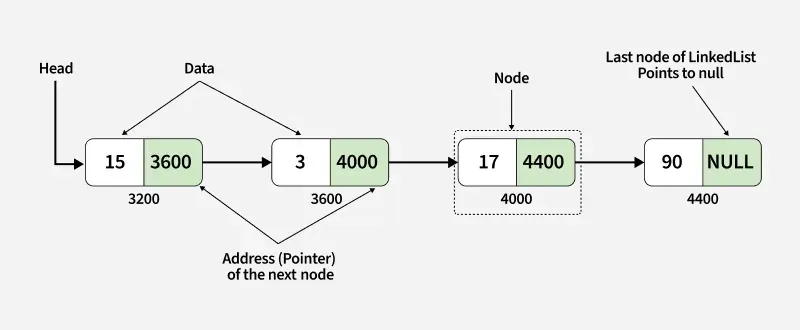

---
title: "Linked Lists"
date: "2025-11-16"
categories: ["Computer Science"]
--- 

## Introduction
A linked list is similar to arrays in that they are used to represent sequential data. However, linked lists are linear collections of data whose order is not given by their physical placement in memory, whereas in arrats, data is stored in sequential blocks of memory. In linked lists, each element contains an address of the next element, so it is a data structure consisting of a collection of nodes which together represent a sequence. 

### Advantages
* Inserting or deleting a node in the list given its location is $O(1)$, whereas in arrays it is $O(n)$, since all the following elements have to be shifted.

### Disadvantages
* Access time is linear because you cannot directly access elements by their position in the list (e.g., in arrays you can just do `arr[4]`). Instead, with linked lists, you have to traverse from the start.

### Types of Linked Lists
* Singly linked list: each node points to the next node, and the last node points to `null`
* Doubly linked list: each node has 2 pointers; `next` points to the next node, and `prev` points to the previous node. Both the `prev` pointer of the first node and the `next` pointer of the last node point to `null`
* Circular linked list: the last node points back to the first node. The `prev` pointer of the first node points to the last node and the `next` pointer of the last node points to the first node.

### Corner Cases
* Empty linked list (i.e., head is `null`)
* List with a single node
* List with two nodes
* Whether the linked list has cycles

## Time Complexity

| Operation | Complexity | Notes |
| :--- | :--: | :--- |
| accessing an element | $O(n)$ | unlike arrays |
| search | $O(n)$ | |
| insert | $O(1)$ | assuming you have traversed to the insertion position |
| remove | $O(1)$ | assuming you have traversed to the node to be removed |