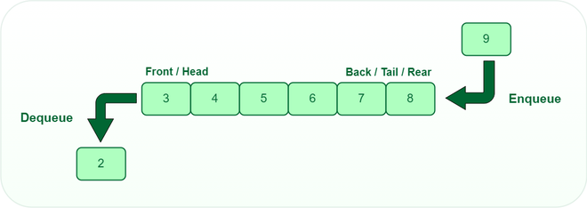

---
title: "Queues"
date: "2025-11-16"
categories: ["Computer Science"]
--- 

## Introduction
A **queue** is a linear collection of elements that are maintained in a sequence and can be modified by the addition of elements at one end of the sequence (**enqueue** operation) and the removal of elements from the other end (**dequeue** operation). Abstractly, queues can be implemented using arrays or single-linked lists.

The behaviour of queues is often called **first in, first out (FIFO)**. 

Breadth-first search (BFS) is commonly implemented using queues. 

### Corner Cases
* Empty queue
* Queue with one or two items

## Time Complexity

| Operation | Complexity | Notes |
| :--- | :--: | :--- |
| enqueue | $O(1)$ OR $O(n)$ | $O(1)$ if using `queue` but $O(n)$ if using a list |
| dequeue | $O(1)$ OR $O(n)$ | $O(1)$ if using `queue` but $O(n)$ if using a list |