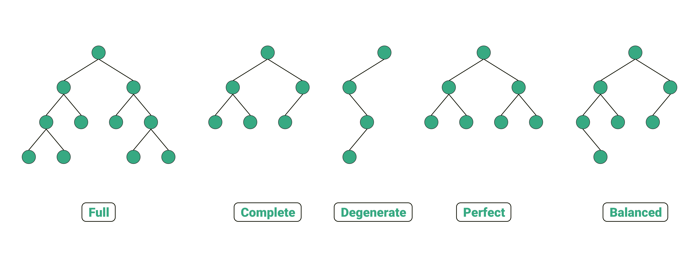

---
title: "Trees"
date: "2025-11-16"
categories: ["Computer Science"]
--- 

## Introduction
A **tree** is a widely-used abstract data type that represents a hierarchical structure with a set of connected nodes. Each node in the tree can be connected to several children, but must be connected to exactly one parent, except for the root node, who has no parent.

Trees are undirected and acyclic, meaning there are no cycles or loops. Each node can be seen as a root node of its own subtree, which makes recursion a useful technique in tree traversal.

The most common type of tree is a **binary tree** (as well as a **binary search tree**, which is a special case of binary trees).

### Binary Tree
In a **binary tree**, each node has a maximum of two children (binary means two). 

There are two key types of binary trees, each with specific structural properties. 

1. **Complete Binary Tree**: a binary tree where all levels, except possibly the last, are completely filled with nodes. If the last level is not completely filled, its nodes are filled from left to right.

   * Such a structure minimizes the tree's height for a given number of nodes. 
   * Complete binary trees are inherently balanced.

2. **Balanced Binary Tree**: a binary tree where for every node, the height difference between its left and right subtrees is no more than 1. 

    * Such a structure prevents the tree from ebcoming skewed or degenerate, which could lead to worst-case performance for search operations. 

