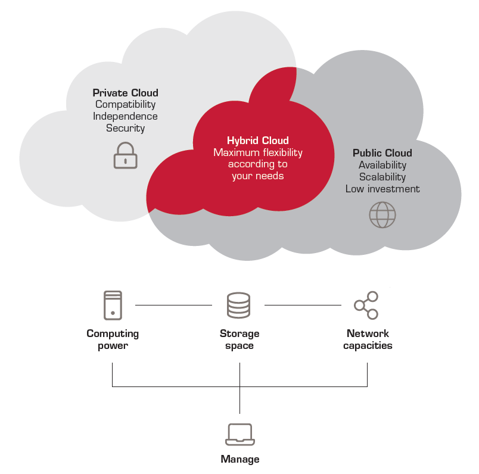

---
title: "Hybrid Cloud"
date: "2026-08-15"
categories: ["Computer Science"]
--- 

## What is Hybrid Cloud?
**Hybrid Cloud** is the strategy by which on-premises or private cloud environments are combined with third-party public cloud environments to create a unified, flexible IT infrastructure.

> #### Hybrid Cloud is a centerfold of IBM's company strategy.
> 
> "As enterprises move AI initiatives from pilot programs into production, demand for hybrid cloud has accelerated. This challenge required businesses to make strategic decisions about where AI workloads run, where data lives, and who governs it." - [IBM, What is hybrid cloud?](https://www.ibm.com/think/topics/hybrid-cloud)

Hybrid cloud has become an industry-standard architecture concept - every major tech vendor has a hybrid cloud story. For example, Microsoft with Azure Arc, AWS with Outposts, and Google with Anthos/Distributed Cloud. The global hybrid cloud market size reached $171.6 billion in 2025, and is projected to grow to $619.6 billion by 2034. This rapid adoption is driven by the need to modernize legacy systems, accelerate digital transformation, and harness AI technologies. 

Most large enterprises don't run everything in one place. They have old on-premises data centers, as well as workloads in public clouds or sometimes private clouds. 

* **On-premises ("on-prem")**: an on-premise cloud is a traditional, local computing environment where a company buys and manages its own physical hardware inside its own building or local data centner.
* **Private Cloud**: a cloud computing environment used exclusively by a single organization; all resources are isolated and operated exclusively for that customer. This is commonly used by organizations that deal with strict regulatory complainace and sensitive data, such as those in the banking, healthcare, and government industries. 
* **Public Cloud**: a cloud computing setting where an external company (known as a third-party cloud service provider, or CSP) owns and runs the physical hardware. Some of these CSPs include AWS, Microsoft Azure, IBM Cloud, or Google Cloud. These CSPs offer public IT services, such as **virtual machines** (a software-based computer that runs inside another physical computer, allowing businesses to run multiple machines virtually), on a pay-as-you-go pricing basis. There are four key public cloud service offerings, each with different levels of support and service: **Software-as-a-Service (SaaS)**, **Platform-as-a-Service (PaaS)**, **Infrastructure-as-a-Service (IaaS)**, and **Serverless computing**. 

## Why Hybrid Cloud?
Hybrid cloud strategies have become more popular because businesses want more flexibility, better security, and less dependence on a single provider. 

If a company runs purely on-premises, everything is running on infrastructure that the company owns and operates itself. While this allows for greater control and customization and more robust data security, scalability is limited, and costs are high - the company must invest in hardware, maintenance, and a large in-house IT team.

A company may also run only on public cloud services, meaning that everything runs on a third-party provider's shared infrastructure. This offers benefits such as pay-as-you-go-pricing, elastic scalability, access to state-of-the-art AI/ML technologies, and lower upfront costs (i.e., the company itself does not pay for the physical hardware). However, such a strategy would not suit businesses with sensitive data or strict compliance requirements.

Hybrid cloud offers a deliberate mix of both on-premises and public cloud methods. Sensitive workloads can be kept on-prem, while taking advantage of cloud scalability, cost-efficiency, and modern services for other workloads. 

This isn't necessarily superior to any other cloud strategy; it must be matched to the client. For example, training and running an AI model is computationally expensive. A company must decide whether to run this model on a public cloud, which has powerful GPUs, but requires company data to leave its walls. A fraud-detection model that uses live customer transaction data would likely need to run close to where the transaction data already lives, while a general chatbot would be fine in public cloud.

IBM's Client Engineering runs on the co-creation of AI pilots. Early AI pilots aren't difficult - they can be made in sandboxes, which are secure, isolated runtime environments where code can be executed without risking host systems or production infrastructure. However, when we move from pilots to production, company constraints - data privacy and governance, for example - suddenly matetr far more. These constraints usually cannot be addressed just by moving everything into a public cloud. Hybrid cloud allows a company to keep secure data and systems where they need to be for compliance and legacy reasons, while still plugging in modern AI capabilities. 

