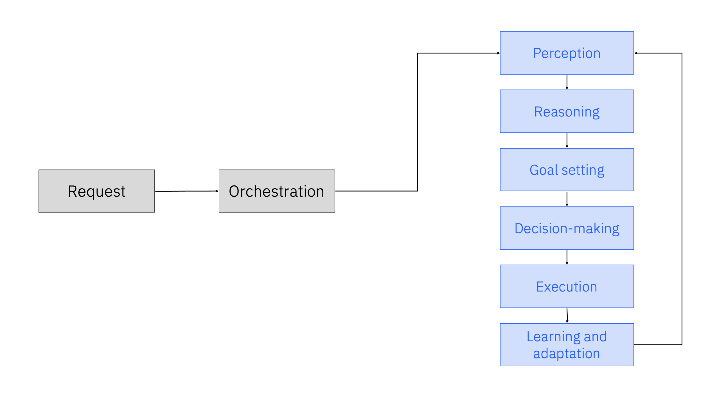
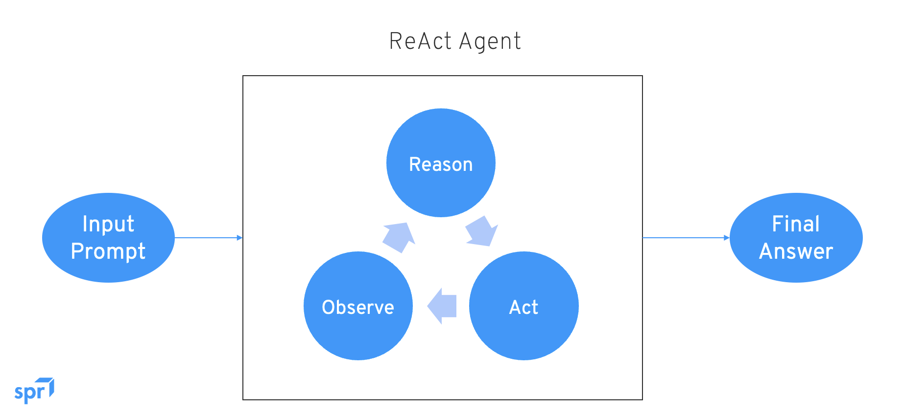
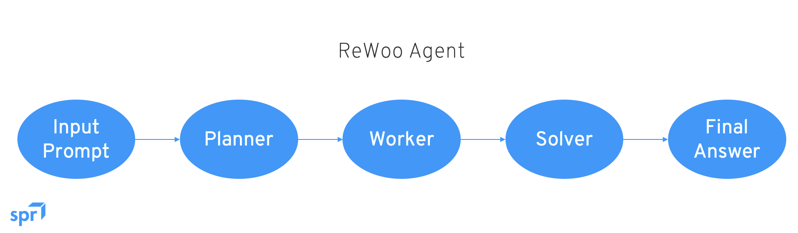

---
title: "AI Agents"
date: "2026-08-23"
categories: ["Computer Science"]
--- 

## Introduction
Since around 2024, agentic AI has been the most salient topic in the field of generative AI. The key reason for the rapid development of agentic AI, as well as the excitement surrounding it, is because AI agents can bring about a significant increase of knowledge worker productivity.

Generative AI burst onto the scene with the release of the (now seemingly ancient) GPT 3.5 model in 2022. Then, it was not immediately clear what the impact of generative AI would be, outside of the obvious. Now, generative AI has evolved such that it isn't just about simply generating content but doing actual work - networks of AI agents will form agentic AI architectures, which will revolutionize knowledge worker productivity. The business world is approaching a point where knowledge worlers will be using - and building - AI agents, which will act as little digital workers that complete tasks and do work on their behalf. 

### The (Potential) Impact of Agentic AI
> With agentic AI, today's frontend systems will become backend systems. 

This statement captures the transformative impact of AI agents. 

Knowledge workers today use dozens of applications to get their work done. These applications may be enterprise software, or internal IT stacks. AI agents propose a new approach: rather than requiring knowledge workers switch from window to window to work with all these different applications, they will simply use an AI assistant style interface, where they write out a request, and the AI agents will work together to complete the task. As in, these agents will now act as the interface between the user and the business applications, making the agents the frontend, and the applications the backend.

AI agents are uniquely posed to enhance enterprise productivity while unlocking remarkable new value for organizations. The goal is to reduce the time it takes to complete tasks, i.e., to increase productivity. AI agents don't just help knowledge workers get more done; they elevate the quality of work and enhance outcomes - they are a game-changer, empowering the workforce to achieve more at a rapid pace. They also allow for the automation of routine processes, minimizing distractions so that teams can focus on strategic thinking and high-value activities. In today's competitive business landscape, companies and workers that effectively use generative AI will inevitably outperform those that don't. 

## What is an AI Agent?
Put simply, an AI agent is a system that can act autonomously to understand, plan, and execute a specific task.

AI agents are built on generative AI techniques - they use **large language models (LLMs)** to function in dynamic environments. Traditional LLMs produce responses based on the data that was used to train them, and are hence bounded by the limits of their knowledge and reasoning. In contrast, AI agents extend upon simply generated content by using that generated content to complete complex tasks autonomously by calling upon external tools. For example, a generative model such as IBM Granite can produce text, images, or code, but agents can use that generation to, for example, not only answer IT help desk questions, but analyze underlying issues, make recommendations, and even implement a solution.

The capabilities of AI agents go far beyond the scope of natural language processing and traditional LLM usage. What makes them so unique is the ability to independently make decisions, solve problems, interact with external environments, and then share details of their decision-making process. Agents can call upon external services to obtain up-to-date information, optimize workflows, call upon pieces of logic internal or external to an enterprise (e.g., fetching a website or using a scientific calculator), and autonomouslt create subtasks to achieve complex goals. And, within this process, agents learn to adapt to user expectations, and further optimize their workflows over time, promoting a personalized user experience.

The starkest difference between AI agents are generative AI usage is that agents are given a high-level objective, while LLMs are most often used for simpler, task-oriented prompts and responses.

In order to act autonomously in their decision-making processes, agents do require goals, environments, backstories, personas, and tasks for these digital laborers that are defined by humans. Given those goals and its available tooling, an agent breaks down the tasks it’s been asked to perform to improve performance, essentially creating a plan of specific tasks and subtasks to accomplish its goals. 

### How do AI Agents Reason?
When given a desired objective, an AI agent will devise a plan to decompose the entire task into smaller subtasks to optimize performance, and then carry out the subtasks according to its plan. Such an approach mitigates the potential for errors, because at every subtask of the desired objective, the agent can reassess its plan and self-correct. This process is known as **reflection**, wherein the agent generates, critiques, and refines its output (either on its own or with the assistance of other agents) through an iterative self-assessment process. To avoid repeating the same mistakes, agents store infroamtion about preferences and solutions to previous challenges in its memory (a knowledge base).

AI agents don't always have the full extent of knowledge needed to tackle all subbtasks within a complex goal. To obtain any missing information, agents use tooling such as **application programming interfaces (APIs)** to data sources, web searches, object detection, cloud storage, email and calendar entries, or even other agents. When given a complex tasks, it can collaborate with other agents, because having the appropriate agent tackle the subtask at hand based on their specialty can augment performance.

LLMs form the core of AI agent reasoning. Reasoning models are capable of reflecting on a goal, and then breaking it down into specific discrete tasks, and then evaluating its output based on feedback.

## What is Agentic AI?
Agentic AI is the framework for accomplishing goals with AI agents under limited supervision.

In multiagent systems, each agent performs a specific subtask required to reach its ultimate goal. The term "agentic" refers to these models' agency and capacity to act independently and with purpose.

An agentic system starts with a user request, alongside any contextual information, and then formulates the user's final goal. The system then uses its reasoning capabilities to decompose the goal down into achievable subcomponents. These subtasks are then executed by calling apon individual agents that are suited to each task. 

Agentic AI systems are able to understand the vision of the user, and uses the information available to them to solve a problem.

Agentic AI can revolutionize every aspect of business. As previously alluded to, most knowledge workers use between 12-30 different applications multiple times a day. This means going back and forth trying to work with different systems, leading to wasted time with tasks that could be streamlined instead. With AI agents, we can imagine a realistic future where a personalized, AI-powered assistant can enhance worker productivity by encouraging less manual switching and navigation through distinct and complex processes.

> Think about the impact that autonomous agents can have in various business sectors: 
> 
> * Healthcare: disease diagnostics, treatment planning, patient care
> * Education: personalized learning experiences, adapting teaching methods, lesson plans
> * Gaming: observe and interact with human players
> * Insurance: customer service aplications can handle policyholder interactions via voice and text, help with claims, fraud, etc. This can have a dramatic impact on customer service resolution times, with responses and actions taking minutes rather than days or weeks
> * Finance: agents can operate independently while adhering to business rules and constraints, and ensuring compliance with regulations. Agents can also enhance transparency and auditability, allowing organizations to track decision-making processes and outcomes amindst rigorous standards.

### How does Agentic AI Work?
Agentic AI tools can take many forms, and different frameworks are better suited to different problems, but the following are the general steps that agentic systems follow to perform their operations: 

0. **Request**: the AI receives a request from the user.
1. **Orchestration**: AI orchestration is the coordination and management of systems and agents. Orchestration platforms automate automate AI workflows, track progress toward task completion, manage resource usage, monitor data flow and memory, and handle failure events. With the correct architecture, hundreds or even thousands of agents could theoretically work together in harmonious productivity.
2. **Perception**: agentic AI begins by collecting data from its environment through sensors, APIs, databases, or user interactions. This ensures that the system has up-to-date information to analyze and act upon.
3. **Reasoning**: once data has been collected, the AI processes it to extract meaningful insights. It uses NLP, computer vision, or other AI capabilities to interpret user queries, detect patterns, and understand broader context so that it can determine what actions to take based on the circumstances.
4. **Goal-setting**: the AI sets objectives based on predefined goals or user inputs, and then develops a plan to achieve those goals, often through the use of decision trees, reinforcement learning, or other planning algorithms.
5. **Decision-making**: the AI evaluates various possible actions, and chooses the optimal one based on factors such as efficiency, accuracy, and projected results. To do so, it may leverage probabilistic models, utility functions, or machine learning-based reasoning to determine the best course of action. In enterprise settings, agents must ensure consistency, transparency, auditability, and adherence to complex rules or constraints. So, it records decision outcomes, and incorporates those insights into future decision-making. 
6. **Execution**: after selection an action, the AI executes it, either by interacting with external systems (such as APIs, data, or robots), or by providing responses answers to users.
7. **Learning and adaptation**: after executing an action, the AI evaluates the outcome, gathering feedback to improve future decisions. Through reinforcement learning or self-supervised learning, the AI refines its strategies over time, making it more suited to handle similar tasks in the future.

To tackle complex tasks, AI agents need to behave like most humans would. A human would first consider the task at hand, then devlop a plan to address it, perhaps using a multi-step approach. Then, completing the task may involve searching for resources - such as scourign the web or looking at data. Progress should be assessed at each stage, making adjustments to the strategy as needed. If a human were to get stuck. they would evaluate whether things were headed in the right direction, and try again using a different approach until they landed on a satisfactory solution. 

While there is not a single standard architecture for building AI agents, there are two key paradigms used in solving multistep problems: 

1. **ReAct** (reasoning and action): a combination of LLM reasoning and external tool execution in an iterative loop (known as the Think-Act-Observe loop). Agents are instructed to "think" and plan after each action taken, and decide which tool to use next based on the response from each tool.
    * Think: the model analyzes the current state using chain-of-thought reasoning, and breaks down what information or step is needed next
    * Action: the agent selects and calls upon an external tool, API, database, or function based on the thought.
    * Observation: the output from the tool is bed back into the model context as a new data point to trigger the next thought.
    * [Iteration]: this cycle is repeated until the agent has determined it has sufficient information to deliver a final answer.

2. **ReWOO** (reasoning without observation): unlike ReAct, ReWOO eliminates the dependence on tool outputs for action planning - rather, agents plan upfront, anticipating which tools they need to complete their goal based on the request they were given. Such an approach is more disireable from a human-centered perspective because the user can confirm the plan before it is executed. The ReWOO workflow is made up of three modules: 
    * Planner: using the user's prompt, the agent anticipates its next steps, building a complete, multi-step blueprint.
    * Worker: execute the planned tool calls without running costly intermediate LLM reasoning, and collect the outputs produced by calling those tools.
    * Solver: synthesizes the final user-facing response using the original plan and all collected evidence from the external tools.

## Deploying AI Agents at Scale
It's easy to look at the raw potential of AI agents and agree that adoption of these agents has great potential for knowledge worker productivity.

However, agentic AI is an entirely new arachitectural pattern - while it may not be difficult to imagine managing a single AI agent, the challenge amplifies substantially when an enterprise has to manage hundreds, or even thousands of agents. If the whole point of AI agents is to enable knowledge workers to be able to build new agents to complete new goals, the practical outcome means that there will be many new AI agents created and deployed every single day. So, it becomes incredibly important to consider how an enterprise will manage large numbers of agents. 

Four key areas of concern for enterprises that are planning on building an active agentic AI practice: 

1. Flexible tools for developing AI agents: for maximum business impact, knowledge workers will need low-code tools to build and customize their AI agents (not all knowledge workers are coders). Coders will need to develop the more sophisticated agents. 
2. Management and governance: once an agent has progressed through its lifecycle to production, the ability to continually monitor its behaviour all the way through to production must be accounted for. This includes collecting the telemetry of agent decisions, investigating and resolving issues with performance and output, comparing performance with benchmarks, setting alerts for abnormal conditions, logging files with agent IDs for traceability, etc. 
3. Security: to be enterprise-ready, AI agents must be deeply integrated into an enterprises's business systems, data centers, and processes, which naturally demands a high degree of security awareness. Systems with AI agent deployments must manage authentication across systems, pass data between tools with consistency, and monitor for vulnerability and attacks. 
4. Guardrails and explainability: a critical challenge developers face when building AI agents is udnerstanding and resolving issues related to unexpected behaviours. Hence, agentic platforms must support a means of observing how an agent behaves, and then using that information to debug issues (i.e., knowing which tools have been called, which inputs were used for the tools, and what was returned). To automate an enterprise use case for production, developers need to account for orchestration complexity - aspects such as error handling or a "human in the loop" - for example, before taking actions considered risky or that require some form of approval. Guardrails must also be in place to protect against the autonomy that agents have and create. And, each decision made by an AI agent needs to be explainable to ensure maximum accountability.

## Resources
*Content adopted from the following resources:*

* [IBM: What are AI Agents?](https://www.ibm.com/think/topics/ai-agents)
* [IBM: What is Agentic AI?](https://www.ibm.com/think/topics/agentic-ai)
* [IBM: AskHR Case Study](https://www.ibm.com/new/announcements/reshaping-hr-with-ai-agents)
