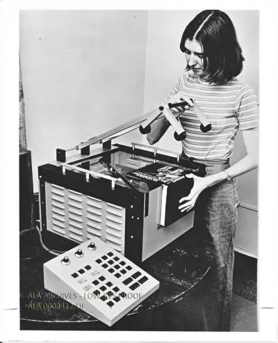
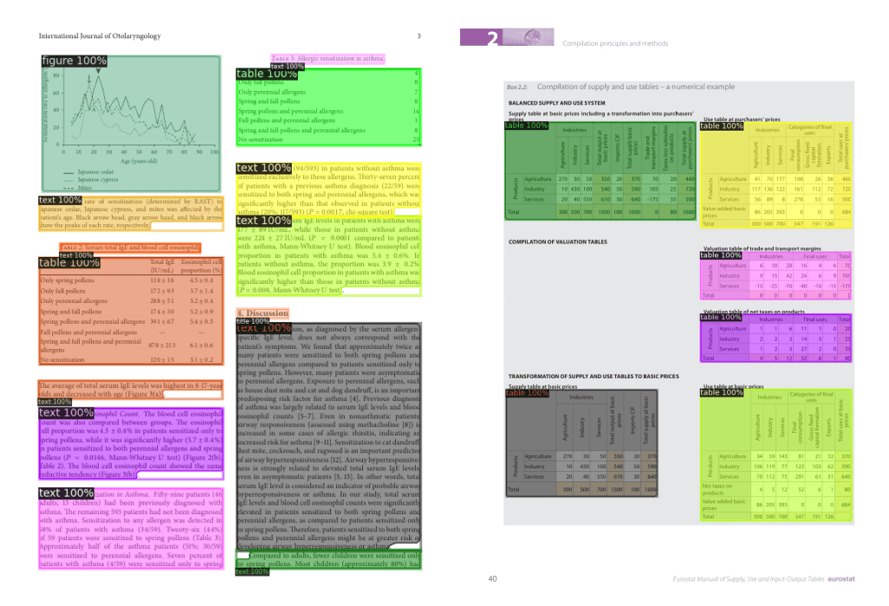

---
title: "Optical Character Recognition (OCR)"
date: "2026-09-14"
categories: ["Computer Science"]
--- 

## What is OCR?
**Optical Character Recognition (OCR)** is the foundational technology behind the conversion of typed, handwritten, or printed text (any sort of physical documents or images of text) into machine-readable, editable, and searchable digital data.

OCR is widely used as a means of data entry from physically printed data records - such as invoices, bank statements, printed data, or any suitable documentation - such that they can be electronically edited and searched, displayed online, stored more compactly, and used in downstream machine processes including text-to-speech, machine translation, and text mining.

There are many benefits to OCR. By converting physical documents and images into editable, machine-readable text, you can now: 
* find keywords in seconds
* reduce manual work and time spent on data entry
* reduce costs by digitizing paper records, which cuts down on physical storage space, printing, and labor costs
* increase accessibility 
* improve security, as digital files are easier to back up, encrypt, and organize

Some common real-world examples of OCR in use include: 
* License plate recognition: toll booths and traffic cameras capture vehicle images and extract license palte nummbers to automate billing or tracking
* Archiving old documents: libraries scan historical books and dociments to make them searchable by keyword
* Travel and translation: smartphone cameras translate foreign street signs or text in real-time

> ### The History of OCR
> Inventor Ray Kurzweil is often credited with the invention of omni-font OCR, in which software is capable of reading almost any printed typeface or font style. Kurzweil used this technology to create the Kurzweil Reading Machine - a computer that read text aloud - for the blind and visually-impaired. This reading machine included a flatbed scanner and a text-to-speech synthesizer.
> 
> The machine operated through a three-step scan -> OCR -> speech pipeline.  
> 
> 1. Image capture (via CCD flatbed scanner, co-invented by Kurzweil and team): a printed document would be placed facedown on a pane of glass. A bright light and a moving sensor grid swept across the page, capturing the physical text and converting the light reflections into a digital grid of electronic signals.
> 2. Text recognition (omni-font OCR): advanced geometric pattern-recognition algorithms were used to analyze the abstract traits of a letter (e.g., an "A" could be characterized by its two slanted lines and a horizontal crossbar). This allowed the computer to recognize text in any notmal font or print style.
> 3. Voice generation (text-to-speech synthesis): once the OCR software identified the letters and words, the data was passed to an internal synthetic speech processor to generate a continuous computer-spoken voice that read the words aloud.
>
> 

## How does OCR Work?
The conversion of images of printed, handwritten, or typed text into editable, machine-readable digital data is a multi-step process.

1. Image acquisition: use a camera or a scanner to capture images of all pages of the document, turning the visual input into a digital file. The OCR software then analyzes the image to identify the text areas and separate them from non-text areas (e.g., images, graphics, or blank spaces). It does so by converting the digital document into a binary image (two-color or black-and-white) and then analyzing the image or bitmap for light and dark portions. The dark portions are characters that need to be recognized, while light areas are background.
2. Preprocessing: the OCR software applies various image processing techniques to improve the quality of the image and enhance the accuracy of text recognition. This may include noise reduction (removing extraneous pixels or artifacts), skew correction (straigtening angled pages), and contrast adjustment (enhancing the visibility of text).
3. **Layout recognition** (or **layout analysis**): a more complete OCR program analyzes the structure of a document to determine the layout of the text, such as paragraphs, tables, columns, and headings. The document is segmented into meaningful geometric and logical units prior to text recognition. This is important for preserving the formatting of the original document in the digital output. Without layout recognition, standard OCR software would read straight across a page horizonally, ignoring the fact that the text may be organized into multiple columns or sections, and producing a jumbled output.

    

4. Text recognition: the dark portions of the image are processed to find alphabetic letters, numeric digits, and symbols. This generally involves targeting one character, word, or block of text at a time. Characters can be identified through pattern recognition or feature recognition. 
    * **Pattern recognition** (or **pattern matching**): the OCR software has previously been trained on examples of text in various fonts and styles. It compares the shapes of the characters in the image to a database of known fonts and styles, looking for similarities in the geometric features of the characters, such as lines, curves, and angles. For this to work, the characters must be in a font that the program has already been trained on, so this works best for printed text in standard fonts.
        * But, given the vast number of fonts worldwide, as well as languages that use different characters (e.g., Chinese, Arabic, Greek, etc.), training on every possible combination of font and language is not computationally feasible. This is where feature recognition is useful.
    * **Feature recognition** (or **feature detection** or **feature extraction**): this allows the OCR software to recognize fonts that it has not been trained on. It applies rules based on the features of a specific characters, such as the number of lines, curves, intersections, and loops. For example, the letter "A" can be identified by its two diagonal lines that meet with a horizontal line in the middle. When a character is identified, it is converted into a machine-readable format, such as ASCII or Unicode for downstream processing. This allows for the identification of text in a wider range of fonts and styles, including handwritten text.
5. Postprocessing: techniques are applied to improve the accuracy of the recognized text. This may include running the extracted text through dictionary and language models to correct spelling errors and verify grammar. The recognized text is then outputted into a machine-readable, searchable document (either in an editable form or PDF).

## Resources
* [Where it all began: the Kurzweil Reading Machine](https://medium.com/illuminifytech/where-it-all-began-the-kurzweil-reading-machine-fed89accc6c7)
* [Accelerating DOcument AI](https://huggingface.co/blog/document-ai)
* [DiT](https://huggingface.co/docs/transformers/main/en/model_doc/dit)