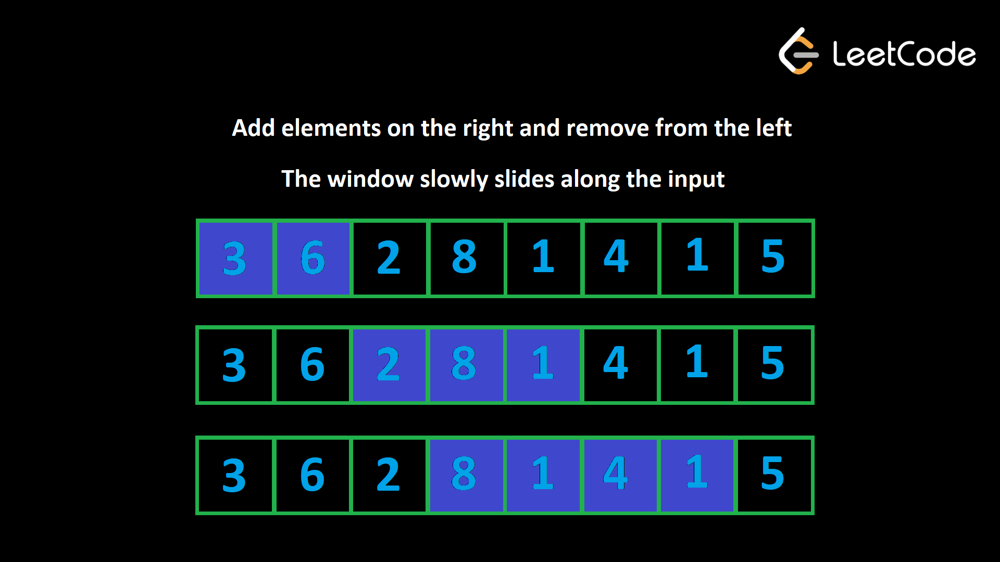

---
title: "Arrays"
date: "2025-11-16"
categories: ["Computer Science"]
--- 

## Introduction
Arrays are among the most common data structures encountered in technical interviews. Typically, with arrays, we are concerned about two things: 

1. the position/index of an element
2. the element itself

### Advantages
* Arrays allow us to store multiple elements under a single variable name
* Accessing elements from an array is fast as long as you have the index (as opposed to linked lists where you need to traverse from the head)

### Disadvantages
* Adding and removing elements into/from the middle of an array is slow ($O(n)$) because the other elements need to be shifted to accommodate the new/removed element (unless, of course, the element to be insterted/removed is at the end of the array)

### Considerations
* Are there duplicate values in the array? Does the presence of duplicate values alter the solution?
* Slicing (e.g., `arr[1:5]`) or concatenating (e.g., `arr + [new_val]`) arrays are $O(n)$ (because they end up creating a new array, which requires copying values over), so avoid doing them when possible.

### Corner Cases
* Empty array
* Array with 1 element
* Duplicated values

## Time Complexity

| Operation | Complexity | Notes |
| :--- | :--: | :--- |
| access | $O(1)$ |  |
| search | $O(n)$ | i.e., traversing through an array to find a value when you do not have its index |
| search (sorted array) | $O(\textnormal{log}n)$ | if an array is already sorted in ascending order, binary search can be applied |
| insert | $O(n)$ | inserting requires shifting all subsequent elements to the right by one, with the exception of the element being at the end, which would be $O(1)$ |
| remove | $O(n)$ | removing requires shifting all subsequent elements to the left by one, with the exception of the element being at the end, which would be $O(1)$ |

## Techniques
Note that these same techniques apply to strings as well, because both arrays and strings are sequences.

### Sliding Window
The sliding window algorithm is used to solve problems involving *contiguous* subarrays or substrings within a sequence. It can potentially optimize time complexity from $O(n^2)$ to $O(n)$.

#### Algorithm
Use two pointers (often `left` and `right`) to define a window within the sequence. The window will slide across the data, expanding or contracting as needed to satisfy a given condition.

* Both pointers start at the beginning of the sequence.
* Expansion: the `right` pointer moves forward, expanding the window by including new elements. As elements are added, a running calculation is updated.
* Contraction: if the current window violates a specified condition, the `left` pointer moves forward, which shrinks the window. Elements removed from the window are then excluded from the running calculation.
Use two pointers, one representing the start and the other representing the end. 
* Expansion and contraction are repeated until the `right` pointer reaches the end of the sequence.

    

#### Example
Taken from [Minimum Size Subarray Sum](https://leetcode.com/problems/minimum-size-subarray-sum/).

Given an array of positive integers `nums` and a positive integer `target`, our task is to return the minimal length of a subarray whose sum is greater than or equal to `target`. If there is no such subarray, we have to return `0`.

> Example 1:
> 
> Input: `target = 4, nums = [1,4,4]`
> 
> Output: `1`
> 
> Example 2:
> 
> Input: `target = 11, nums = [1,1,1,1,1,1,1,1]`
> 
> Output: `0`

The intiutive solution is to go through all subarrays and check the sum of each one, and if the sum is greater than or equal to `target`, we update outr answer variable. This would be implemented via two loops; the outer loop controls the starting point, and the inner loop controls the ending point. This would take $O(n^2)$, which is inefficient.

Brute force solution $O(n^2)$: 

```python
def minSubArrayLen(target: int, nums: List[int]) -> int:
        
    min_length = float(inf)
    n = len(nums)

    # outer loop is O(n)
    for start_i in range(n): 
        current_sum = 0
        # inner loop is O(n)
        for end_i in range(start_i, n): 

            # accessing single index is O(1)
            current_sum += nums[end_i]

            if current_sum >= target: 

                min_length = min(min_length, end_i - start_i + 1)
                break

    return min_length if min_length != float(inf) else 0
```

We can reduce the complexity of this problem by leveraging the sliding window algorithm. We will use two pointers `left` and `right` to denote the starting and ending indices of our window. These pointers will both start with the value `0`. 

Then, we loop over the array and increment `right` to add elements to our window. The constraint of this problem is reached if the window's sum is greater than or equal to `target`, so when that occurs, we update the answer, and then remove elements from the window by incrementing `left` until the sum is less than `target`. 

Sliding window implementation ($O(n)$): 

```python
def minSubArrayLen(target: int, nums: List[int]) -> int:

    # both pointers start at the 0th index
    left = 0
    right = 0
    # sum for the current window
    current_sum = 0
    min_length = float("inf")

    # continue incrementing right until end of nums
    for right in range(0, len(nums)): 

        current_sum += nums[right]

        while current_sum >= target: 

            min_length = min(min_length, right - left + 1)
            # remove the first element from the window
            current_sum -= nums[left]
            # shrink the window from the left
            left += 1

    return min_length if min_length != float("inf") ele 0
```

Even though there is an inner `while` loop inside the outer `for` loop, the time complexity in the sliding window implementation is $O(n)$. This is because the inner loop is *not* running $n$ times for each iteration of the outer loop; rather, a sliding window guarantees a maximum of $2n$ window iterations.

#### General Format
For a dynamic window: 

```python
def sliding_window_dynamic(seq): 

    # intialize the window and the response variable
    right = 0
    left = 0
    ans = float("inf")
    current_window = 0

    for right in range(len(seq)): 

        # append seq[right] to the window
        current_window += seq[right]
        # while the condition is invalid, move left forward
        while INVALID(window): 
            # remove seq[left] from the window
            current_window -= seq[left]
            left += 1
        
        # attempt to update answer
        ans = min(ans, current_window)
    
    return ans
```

### Two Pointers
The Two Pointers algorithm is a more generalized version of the Sliding Window that is best used in cases that involve finding pairs or interacting elements of q sequence that do *not* have to be contiguous. The pointers are allowed to cross each other, or can be on different arrays. Similar to the sliding window, instead of checkin every possible pair `(i, j)` (which is $O(n^2)$), we use two indices that move based on conditions.

#### Algorithm
The Two Pointers algorithm can come in a few different flavors. 

1. Opposite direction: 

    * We have `left` and `right` pointers that converge towards the middle of the sequence
    * These are useful in cases where your sequence is sorted, and the ultimate result you want is a pair of something (e.g., the smallest and the largest value).

2. Same direction (fast and slow): 

    * We have two pointers `fast` and `slow`, where the `fast` pointer is incremented more than the `slow` pointer
    * This is useful in problems such as duplicate removal, and finding the longest subarray with some constraint
    * This is the same thing as the Sliding Window

3. Two arrays (one pointer each):

    * Two Pointers can also be used in separate arrays, wherein each array is assigned a pointer.
    * This is useful in problems such as merging, finding the intersection, and comparing sorted lists.

#### Opposite Pointers Example
Taken from [Neetcode's Valid Palindrome](https://neetcode.io/problems/is-palindrome?list=neetcode150).

Given a string `s`, return `true` if it is a palindrome, otherwise return `false`.

A palindrome is a string that reads the same forward and backward. It is also case-insensitive and ignores all non-alphanumeric characters.

Note: Alphanumeric characters consist of letters (A-Z, a-z) and numbers (0-9).

> Example 1:
> Input: `s = "Was it a car or a cat I saw?"`
> Output: `true`
> Explanation: After considering only alphanumerical characters we have "wasitacaroracatisaw", which is a palindrome.
> Example 2:
> Input: `s = "tab a cat"`
> Output: `false`
> Explanation: "tabacat" is not a palindrome.

The brute force solution would be to create a copy of the input string, reverse it, and then check for equality. However, this is an $O(n)$ solution with extra space.

Consider that a palindromic string is one that reads the same from the start as well as from the end, meaning that the character at the start should match the character at the end at the same index. This is a great place to apply the opposite pointers variant of the Two Pointers algorithm.

```python
def isPalindrome(s: str) -> bool: 

    # intialize left and right pointers
    left = 0
    right = len(s) - 1

    # continue iterating as long as left < right
    while left < right: 

        # if a char is non-alphanumeric, skip it
        while left < right and not s[right].isalnum(): 

            right -= 1

        # same for left
        while left < right and not s[left].isalnum(): 

            left += 1

        # check for equality once both pointers have been positioned correctly
        if s[right].lower() != s[left].lower(): 
            return False

        # update the pointers
        right -= 1
        left += 1

    return True
```