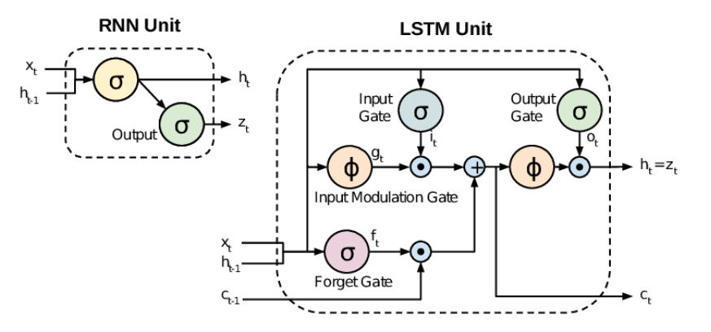

---
title: "Attention Is All You Need"
date: "2026-01-26"
categories: ["Computer Science"]
bibliography: attn.bib
draft: true
--- 

## Introduction
*Attention Is All You Need* is a landmark research paper in machine learning published in 2017 by eight Google scientists. The paper introduced the now mainstream deep learning architecture known as the **transformer**. It is considered a foundational paper in modern artificial intelligence, and a principal contributor to the AI boom, as the transformer now underlies most modern large language models. The key reason why the transformer architecture is preferred by modern LLMs is its parallelizability as compared to its predecessors; this ensures that the numerous operations necessary for training can be accelerated on a GPU, allowing for both faster training times and for larger models to be trained.

### Baseline Concepts
Understanding *Attention Is All You Need* requires familiarity with some baseline concepts in deep learning.

All the architectures we will cover are built upon the aim of sequence modeling. **Sequence modeling** is a machine learning approach that analyzes and predicts *ordered*, *sequential* data by considering dependencies between elements, rather than treating them in isolation. It is used to forecast future data points or generate new sequences based on previous context, such as in language modeling and time-series forecasting. 

Prior to transformers, sequence modeling and generation was done using Recurrent Neural Networks. Recurrent Neural Networks (RNNs) are a class of neural networks designed to process sequential or time-series data by maintaining an internal memory - knoan as a hidden state - of previous inputs. To do this, RNNs use feedback loops to pass information from one step to the next, allowing for information to persist, and for the model to use previous inputs to inform the current output.

Abstractly speaking, an RNN is a function $f_\theta$ of type $(x_t, h_t) \longmapsto (y_t, h_{t+1})$ where: 

* $x_t$: input vector
* $h_t$: hidden vector
* $y_t$: output vector
* $\theta$: NN parameters

In words, an RNN is a neural network that maps an input $x_t$ into an output $y_t$, with the hidden vector $h_t$ playing the role of "memory," a partial record of all previous input-output pairs. At each step, it transforms the input to an output, and updates its "memory" to improve performance in future processing.

There is, however, a common issue associated with RNNs known as the **vanishing gradient problem**. RNNs learn via backpropagation through time, during which gradients get multiplied repeatedly. This then means that if gradients are less than 1, they shrink near zero - this is particularly common in deep architectures, making it difficult to capture long-term dependencies. As such, **long short-term memory (LSTM)**, designed to solve the vanishing gradient problem, has now become the most widely-used RNN architecture. Unlike standard RNNs, LSTM units consist of a memory cell that maintains its state over arbitrary time intervals, and three main gates that regulate information flow in and out of the cell: 1) an input gate, 2) an output gate, and 3) a forget gate. 

* The **input gates** decide which pieces of new information to store in the current cell state.
* The **output gates** control which pieces of information in the current cell state to output.
* The **forget gates** decide what information to discard from the previous state.

The key idea of LSTMs is that they selectively output relevant information from the current state, so that it can maintain useful, long-term dependencies to make accurate predictions in both current and future time-steps. They are able to resolve the vanishing gradient problem because they can remember information for long periods, making them ideal for long sequences where traditional RNNs fail.

Another relevant key concept is **sequence-to-sequence (seq2seq) modeling**, a powerful deep learning architecture designed to convert an input sequence into a corresponding output sequence. It operates via an **encoder-decoder** framework. 

* The **encoder** processes the input sequence into a fixed-length context vector
* The **decoder** uses the context vector to generate the output sequence, token by token

In practice, seq2seq maps an input sequence into a real-numerical vector via a neural network (the encoder), and then maps it back into an output sequence using another neural network (the decoder). Earlier models used RNNs, but modern seq2seq often uses transformers (encoder-decoder) for better performance.

In 2014, Bahdanau et al. [@CITE] introduced the **attention mechanism**, which addressed the bottleneck of fixed-size vectors by allowing the decoder to focus on specific parts of the input sequence, significantly improving accuracy for longer sequences. As in, attention enables the model to selectively focus on different parts of the input sequence during the decoding process. At each decoder step, an attention score is computed, and a softmax function is applied to the score to get the attention weight.

**Attention weights** are computed by the model on its own. The model constructs a triple of vectors: **key**, **query**, and **value** (analogized to database queries). One can envision this system as there being a "database" in the form of a list of key-value pairs. Then, the decoder sends in a query, and obtains a reply in the form of a weighted sum of the values, where the weight is proportional to how closely the query resembles each key.