---
title: "Ornithischia"
subtitle: "Bird-hipped dinosaurs"
date: "2026-04-01"
categories: ["Paleontology"]
--- 

## Introduction
Dinosaurs can be split into two major groups - **Ornithischia** and **Saurischia** - distinguished by their hip structure. Ornithischia literally means "bird-hipped," though this can be misleading, as birds are theropods (saurischians) and are not included within Ornithischia. The name "bird-hipped" is meant to highlight the structural similarity between the ornithischian hip (a back-turned pubis, running parallel to the ischium) and the hip of a modern bird, though these similarities are not a product of evolutionary relationships but rather of convergent evolution.

## What Defines an Ornithischian?
Ornithischians can be defined as all dinosaurs more closely related to *Triceratops* than to sauropodomorphs or theropods (the two major groups within Saurischia). This group contains well-known dinosaurs such as *Triceratops*, *Ankylosaurus*, and *Stegosaurus*.

All synapomorphies (characters that distinguish the group from Saurischia) of Ornithischia are related to ornithischians being **herbivorous**. 

* **Predentary bone**: an unpaired, toothless bone found at the front of the lower jaw, forming the lower half of a beak. This bone was used to crop vegetation.

    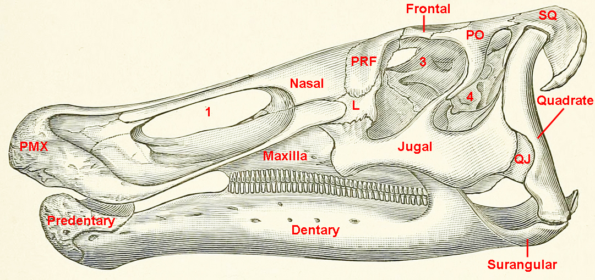

    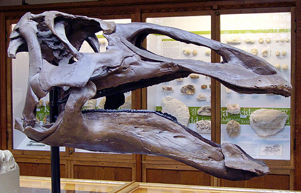

* Blunt teeth: this may or may not be a synapomorphy. These blunt teeth were adapted for crushing and chewing plant material, as opposed to the sharp teeth of carnivorous theropods designed for tearing flesh.

    

* Inset jaw margins: the inward setting of the tooth rows relative to the outer jaw bone, indicating muscular cheeks optimized for chewing.

    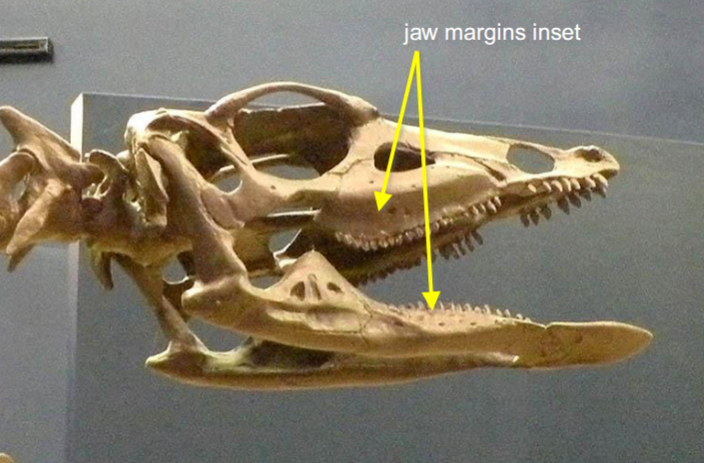

* Back-turned pubis: a backward-turned pubis that is parallel to the **ischium**, allowing for a larger gut (to aid in digesting plant material) and potentially to support a change in the center of mass. Ancestrally in dinosaurs, the pubis is forward-pointing.

    

    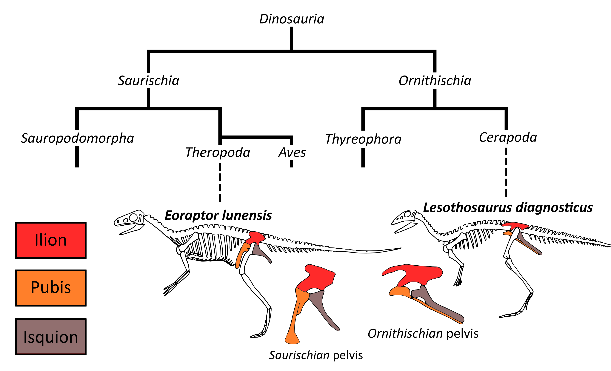

* **Ossified tendons** along vertebral column: ossified tendons are connective tissues that have transformed into bone, and can support significant muscular loads. Their presence on the vertebral column of ornithischian dinosaurs helped stiffen the back for posture and locomotion, and also to support a large gut.

    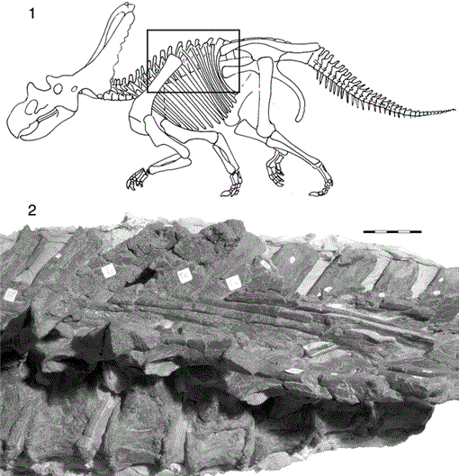

    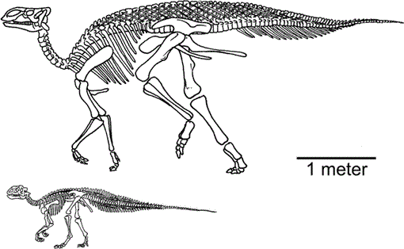

Again, all the aforementioned synapomorphies developed in support of the ornithischian lifestyle of herbivory, in terms of both mechanical and microbial processing. 

Ornithischians were unique in their ability to process plant matter through complex **chewing** - this is an example of **mechanical processing**. The predentary bone formed a beak that could crop vegetation, and their blunt teeth and muscular cheek (evidenced by inset jaw margins) aided in the physical breakdown of plants. 

On the side of **microbial processing**, ornithischians developed traits that helped support their large, long gut tract and balance a shifted center of mass at the hip. The back-turned pubis allowed more space for the longer gut tract, while the ossified tendons aided in stability of the vertebral column.

## Ornithischian Diversity
Ornithischia is split into three major groups, all of which are herbivores and share the aforementioned synapomorphies. The three groups are **Thyreophora** (armored dinosaurs), **Ornithopoda** (bird-footed dinosaurs), and **Marginocephalia** (bone-headed and horned dinosaurs).

These dinosaurs also developed showy ornaments that function in display, such as frills, horns, and crests, as a means of **sexual selection**. This is a prominent theme in ornithischians. While sexual selection does not adapt the individual to their environment (as in natural selection), it enhances traits involved in mate acquisition, and hence the offspring in the next generation. It arises in response to either female choice (in which females choose males based on ornamentation of behaviours) or male competition (in which males compete for access to females or mating grounds).

### Thyreophora: Armored Dinosaurs
**Thyreophorans**, or armored dinosaurs, are characterized by the presence of body armor lined in longitudinal rows along the body. While more primitive forms had simpler **osteoderms**, more derived forms devloped more elaborate structures such as spikes or plates. Early thyreophorans were bipedal, but they quickly evolved quadrupedality.

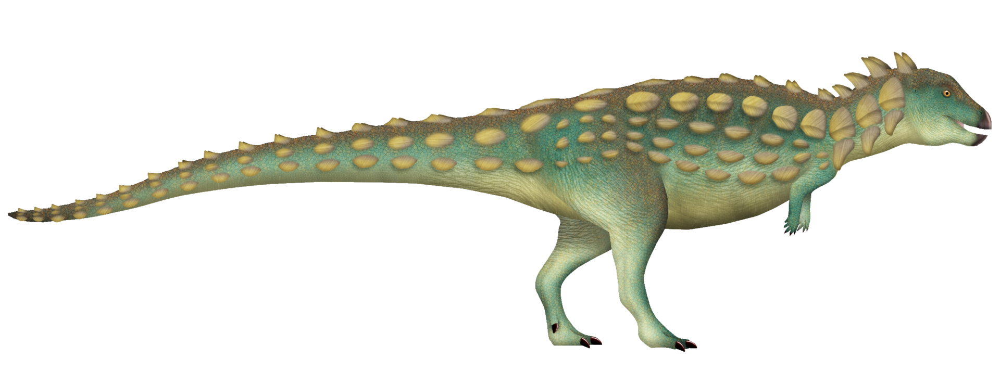

The two major (and very famous) subgroups within Thyreophora are **Ankylosauria** and **Stegosauria**.

Ankylosauria includes both **Ankylosauridae** and **Nodosauridae**. While both are ankylosaurian dinosaurs, they differ in their tail weaponry and snout shape. Ankylosaurids possessed a large, bony tail club and a broad snout, while nodosaurids lacked a tail club, had narrower snouts, and often had prominent shoulder spikes.

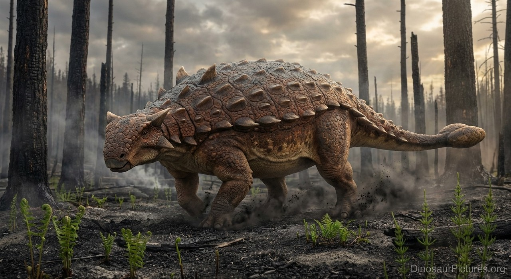

.](Nodosaur.jpg)

**Stegosaurs** are recognized by their two rows of bony, kite-shaped plates along their black, and long, defensive tail spikes known as a **thagomizer**. It is widely thought that stegosaur dorsal osteoderms were used for display purposes and potentially thermoregulation, as they were too thin and fragile for defense. The thagomizer, however, was used for defense, and culod inflict fatal wounds on predators.

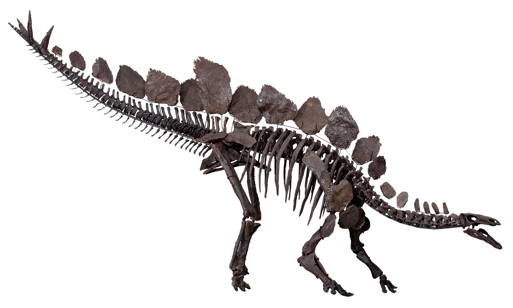

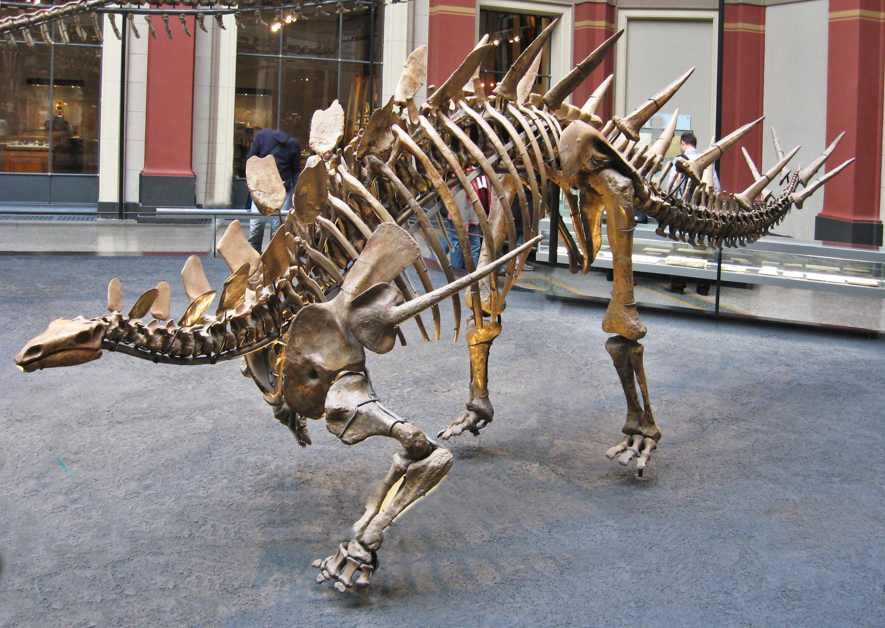

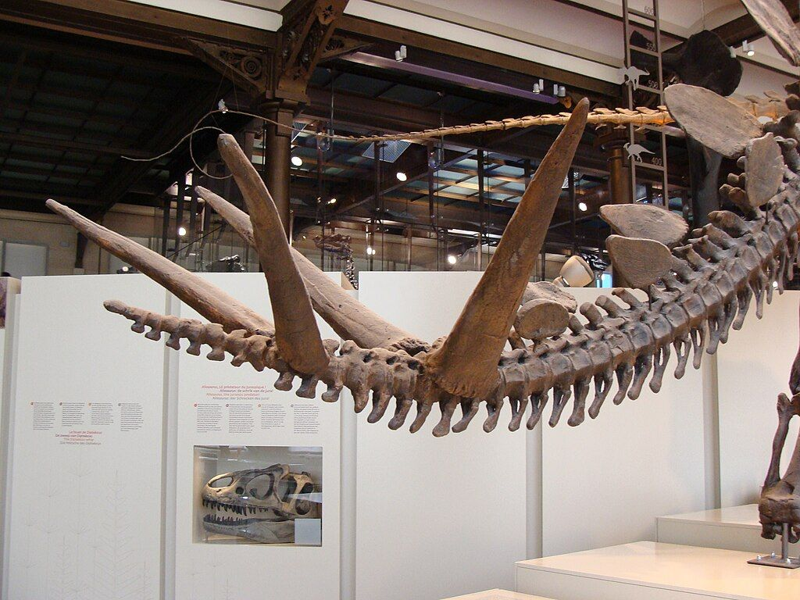

### Ornithopoda: Bird-Footed Dinosaurs
**Ornithopoda** included some of the most successful herbivorous dinosaurs during the Cretaceous, and included the famous *Iguanodon* and **hadrosaurs**. This group of dinosaurs is known as bird-footed due to their three-toed feet, similar to that of modern birds. As with thyreophorans, they were ancestrally bipedal, but became quadrupedal.

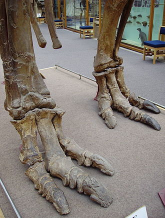

Ornithopoda includes some famous groups - **Iguanodontidae** and **Hadrosauridae**.

**Iguanodontidae** contains some of the earliest discovered dinosaurs, including the famous *Iguanodon*. Iguanodontians are often defined by their characteristic thumb spike.

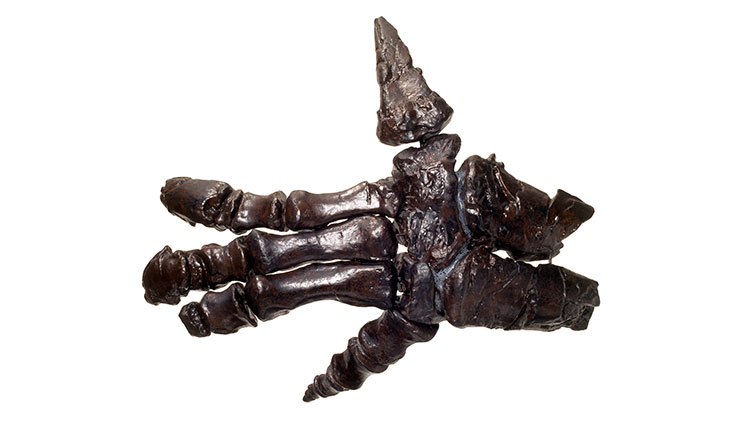

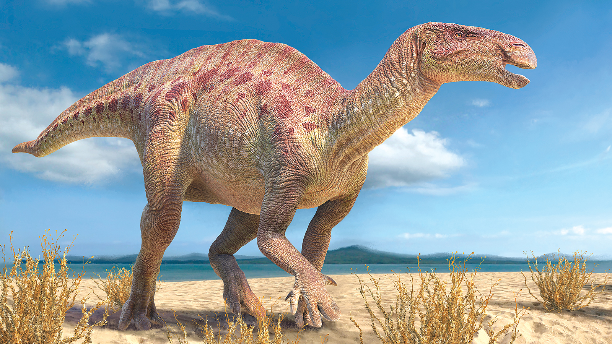

**Hadrosaurs** are also known as duck-billed dinosaurs due to the duck-bill appearance of their snouts. They were well-adapted for chewing and possessed a highly efficient, complex **dental battery** similar to that of ceratopsians (though they evolved independently). Hadrosaurs were amongst the most prominent herbivores during the Late Cretaceous. 

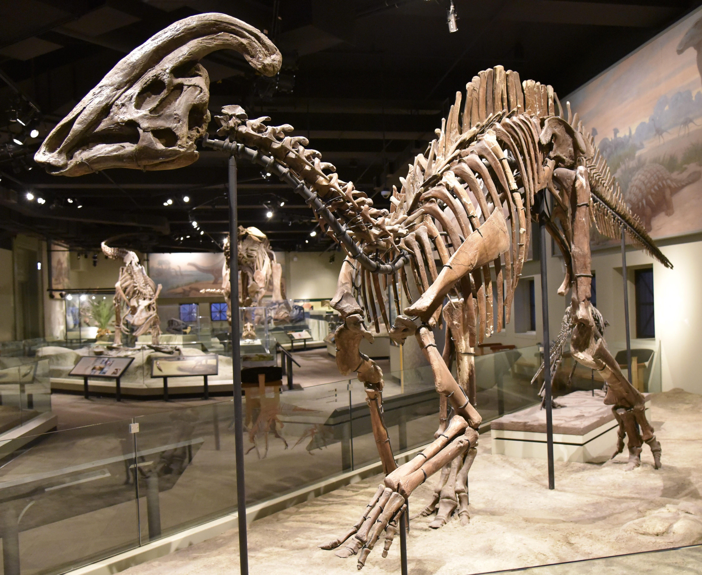

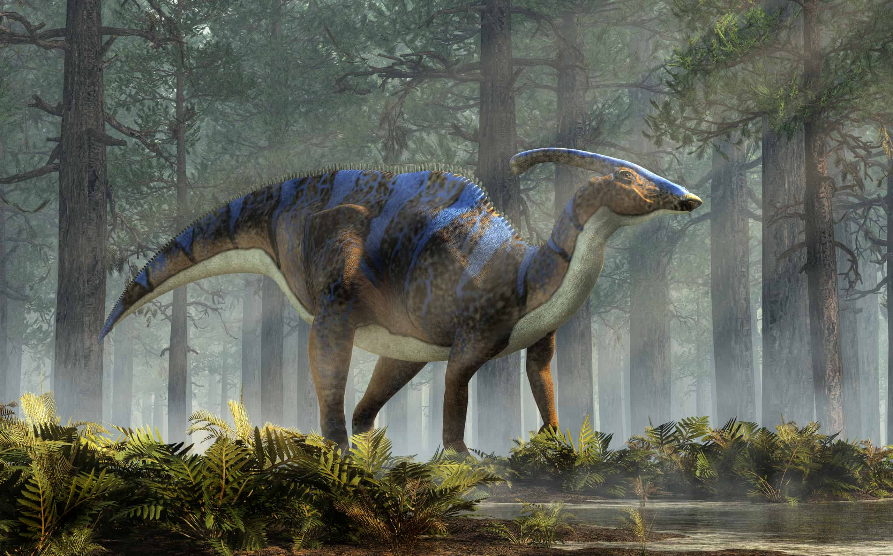

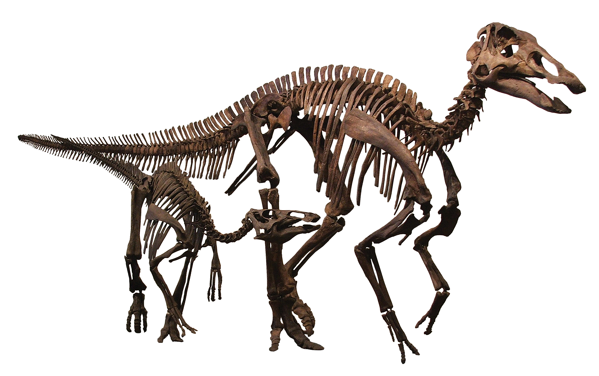

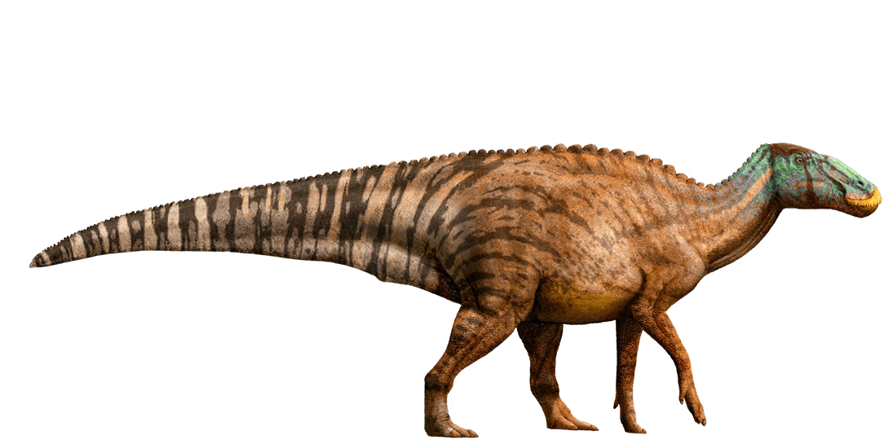

### Marginocephalia: Bone-Headed and Horned Dinosaurs
**Marginocephalia** is a clade of dinosaurs characterized by a bony shelf or margin at the back of the skull. These fringes were most likely used for display. The two main clades within Marginocephalia are **Ceratopsia**, which includes the famed *Triceratops*, and **Pachycephalosauria**, which includes *Pachycephalosaurus*.

**Ceratopsians** were beaked, herbivorous dinosaurs that sported a variety of horns and frills. This group was well-adapted for **chewing**, possessing a beak on both the upper and lower jaw, as well as teeth imbricated together into dental batteries. Additionally, their deep-rooted teeth aided in grinding vegetation.

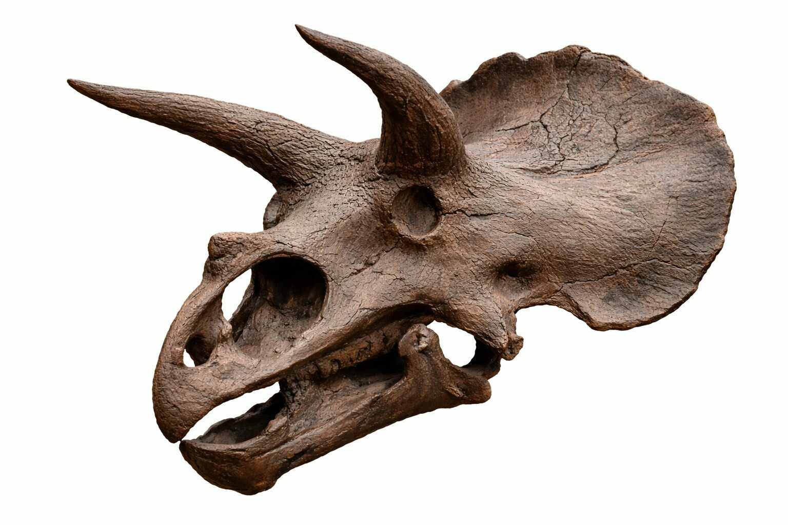

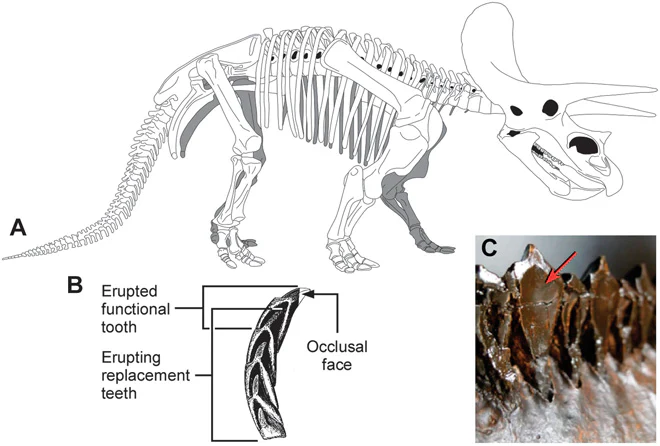

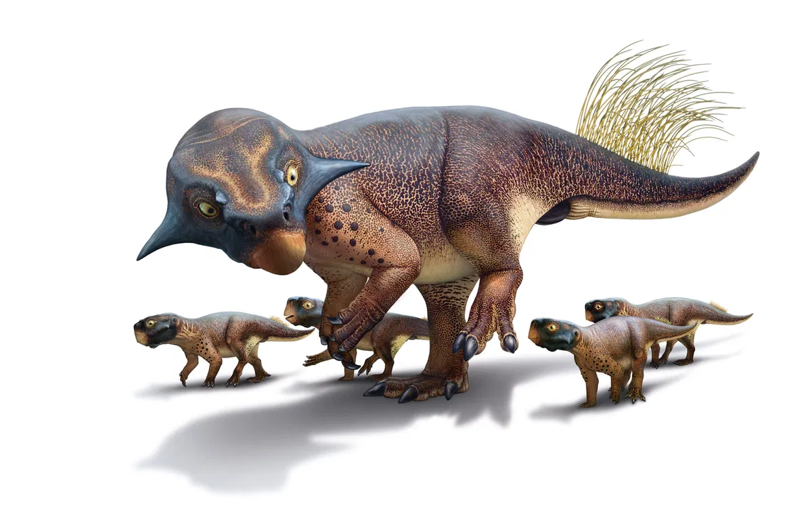

**Pachycephalosaurs** are bipedal marginocephalians defined by a large, thick, bony dome on its head, likely used in head-butting contests, similar to the way modern rams use their horns. It is also possible that the dome was (also) a sexually-selected trait. Sexually-selected traits change from juveniles to adults; it has been found that the dome is present only in adults, meaning that the structure is especially important in adults.

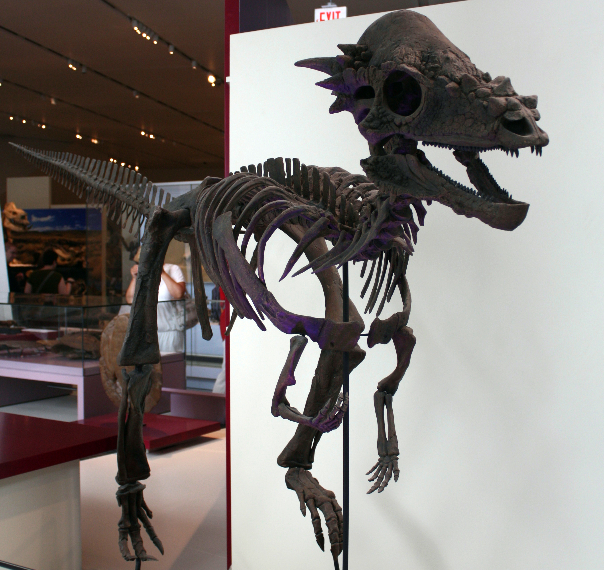

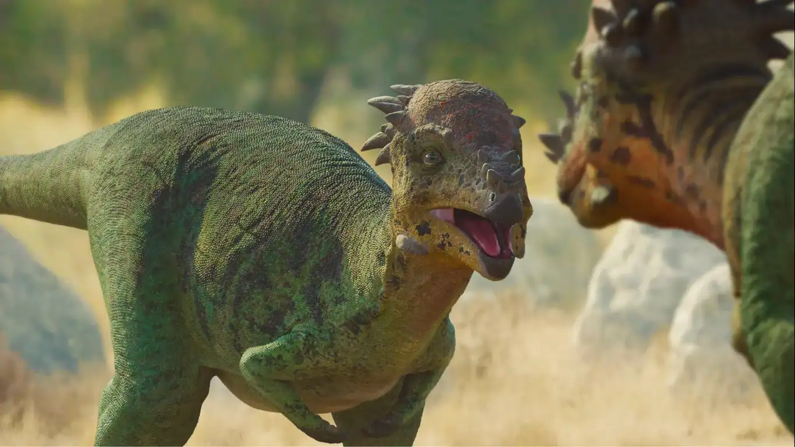
