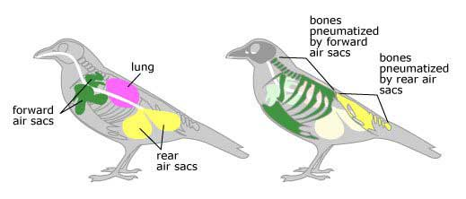
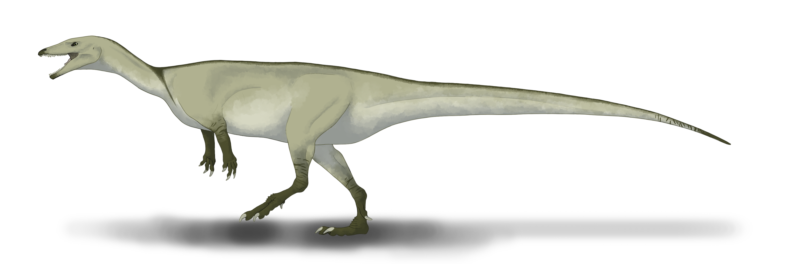
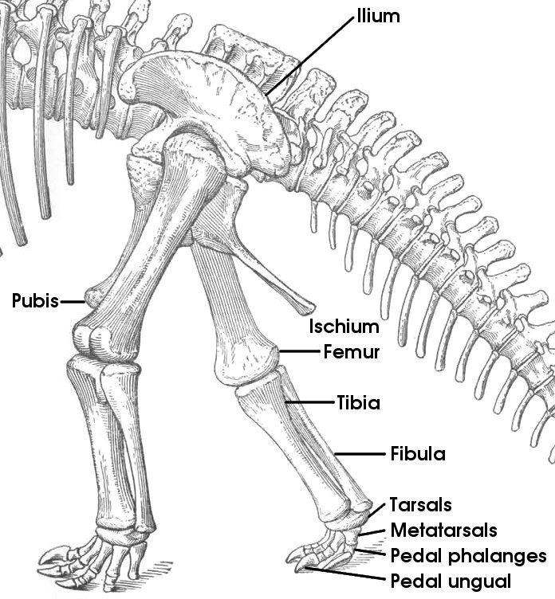
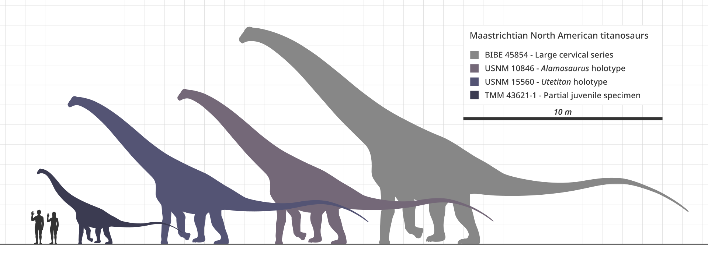
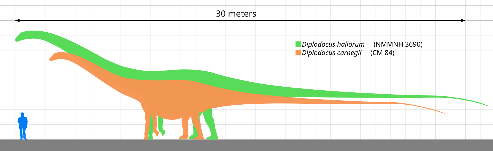

---
title: "Saurischia"
subtitle: "Lizard-hipped dinosaurs"
date: "2026-04-01"
categories: ["Paleontology"]
draft: true
--- 

## Introduction
Dinosaurs can be split into two major groups - Ornithischia and Saurischia - distinguished by their hip structure. Saurischians are known as "lizard-hipped" because they maintained the ancestral hip anatomy that is found in modern lizards and other reptiles.

Saurischia includes all carnivorous dinosaurs, as well as birds.

## What Defines a Saurischian?
Saurischians are distinguished from "bird-hipped" ornithischians by the retention of the ancestral reptilian hip structure, where the pubis is front-facing. 

The most famous carnivorous dinosaurs, such as *Tyrannosaurus* and *Allosaurus*, as well as the largest land animals of all time in the sauropods, are contained within Saurischia. Also, birds are saurischians, making them the only extant dinosaurs today. All saurischians, with the exception of derived sauropodomorphs, are bipedal, including birds.

Saurischian synapomorphies: 

* Enlarged thumb: an especially large, sometimes offset, first digit.

    

* Air sacs in the body cavity: these air sacs were connected to the lungs, characterizing a bird-like respiratory system. This allowed saurischians to develop massive body sizes while reducing the weight of the skeleton, and also increased oxygen efficiency by provifing a highly efficient, single-direction airflow (similar to that of modern birds).

    

    

## Saurischian Diversity
Saurischia is split into two major groups: Sauropodomorpha and Theropoda. 

### Sauropodomorpha
Sauropodomorpha is the clade of dinosaurs that includes the long-necked, herbivorous sauropods, and all their ancestral relatives. The earlier, more basal sauropodomorphs (often called prosauropods) maintained the plesiomorphic mode of bipedal locomotion, and the earliest show evidence of omnivorous or carnivorous diets. Over time, sauropodomorphs saw a shift to herbivorous diets, larger body sizes, and quadrupedal locomotion. The resulting sauropods becaome the largest land animals of all time.

Generally, sauropodomorphs are defined by their blunt teeth and a long neck with a small head. Similar to ornithischians, these traits made sauropodomorphs well-adapted for an herbivorous lifestyle. However, unlike ornithischians (ceratopsians in particular), sauropodomorphs did not rely on chewing for the physical breakdown of vegetation; rather, they ingested gastroliths (stomach stones) to aid in grinding tough plant matter in their digestive systems. Additionally, while ornithischians adapted a back-turned pubis to support a longer intestinal track for microbial processing, sauropodomorphs instead had a longer torso.

Sauropodomorpha includes Sauropoda, which contains the well-known sauropods. 

Sauropods are best defined by the extremely long neck, as well as an enlarged external naris that is shifted upwards.

.](bBrachiosaurus_Skull_Diagram.svg)

Sauropods also had columnar limbs with a reduced number of phalanges, which helped support their weight. These limbs featured straightened bones with reduced muscle attachement points and limited flexion. These limbs were arranged to be vertically oriented, maximizing the weight-bearing capacity (rather than speed). Such a structure can also be seen in modern elephants.

Most notably, some of the largest sauropods are contained in the group Titanosauria (within Macronaria). 

Diplodocidae is another group of sauropod dinosaurs that includes some of the longest animals to walk the Earth - it is said that some specimens could have reached lengths of 30 meters or more.

