---
title: "Saurischia"
subtitle: "Lizard-hipped dinosaurs"
date: "2026-04-01"
categories: ["Paleontology"]
--- 

## Introduction
Dinosaurs can be split into two major groups - **Ornithischia** and **Saurischia** - distinguished by their hip structure. Saurischians are known as "lizard-hipped" because they maintained the ancestral hip anatomy that is found in modern lizards and other reptiles.

Saurischia includes all carnivorous dinosaurs, as well as birds.

## What Defines a Saurischian?
Saurischians are distinguished from "bird-hipped" ornithischians by the retention of the ancestral reptilian hip structure, where the pubis is front-facing. 

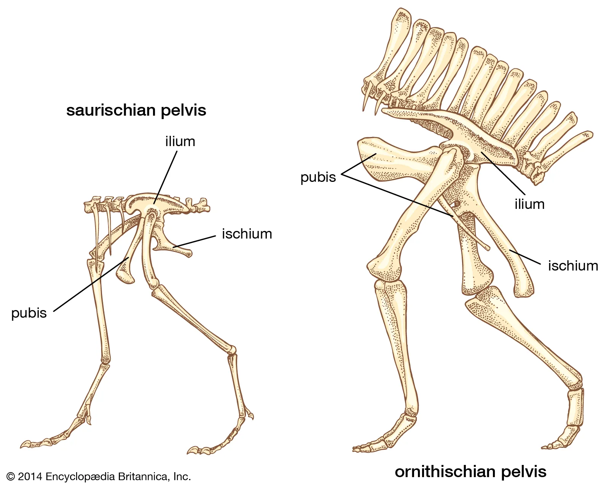

The most famous carnivorous dinosaurs, such as *Tyrannosaurus* and *Allosaurus*, as well as the largest land animals of all time in the sauropods, are contained within Saurischia. Also, birds are saurischians, making them the only extant dinosaurs today. All saurischians, with the exception of derived sauropodomorphs, are bipedal, including birds.

Saurischian synapomorphies: 

* Enlarged thumb: an especially large, sometimes offset, first digit.

    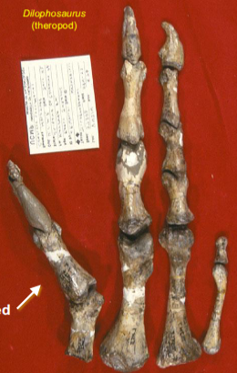

* **Air sacs** in the body cavity: these air sacs were connected to the lungs, characterizing a bird-like respiratory system. This allowed saurischians to develop massive body sizes while reducing the weight of the skeleton, and also increased oxygen efficiency by providing a highly efficient, single-direction airflow (similar to that of modern birds).

    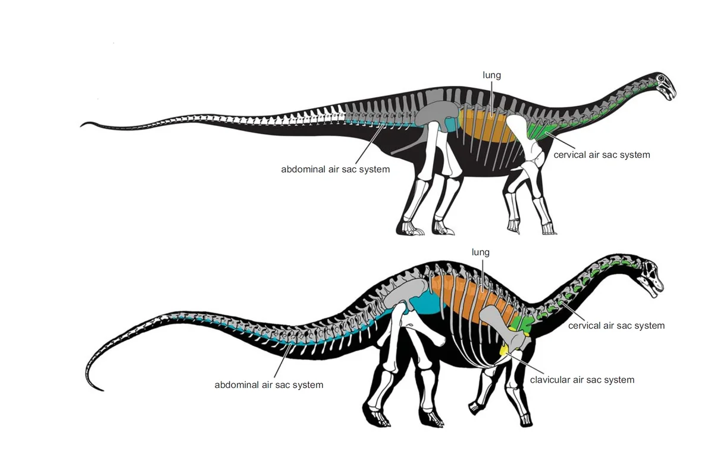

    

## Saurischian Diversity
Saurischia is split into two major groups: **Sauropodomorpha** and **Theropoda**. 

### Sauropodomorpha
**Sauropodomorpha** is the clade of dinosaurs that includes the long-necked, herbivorous **sauropods**, and all their ancestral relatives. The earlier, more basal **sauropodomorphs** (often called **prosauropods**) maintained the plesiomorphic mode of bipedal locomotion, and the earliest show evidence of omnivorous or carnivorous diets. Over time, sauropodomorphs saw a shift to herbivorous diets, larger body sizes, and quadrupedal locomotion. The resulting sauropods became the largest land animals of all time.

Generally, sauropodomorphs are defined by their blunt teeth and a long neck with a small head. Similar to ornithischians, these traits made sauropodomorphs well-adapted for an herbivorous lifestyle. However, unlike ornithischians (ceratopsians in particular), sauropodomorphs did not rely on chewing for the physical breakdown of vegetation; rather, they ingested **gastroliths** (stomach stones) to aid in grinding tough plant matter in their digestive systems. Additionally, while ornithischians adapted a back-turned pubis to support a longer intestinal track for microbial processing, sauropodomorphs instead had a longer torso.

Sauropodomorpha includes **Sauropoda**, which contains the well-known sauropods. 

Sauropods are best defined by their extremely long neck, as well as an enlarged external naris that is shifted upwards.

.](bBrachiosaurus_Skull_Diagram.svg)

Sauropods also had columnar limbs with a reduced number of phalanges, which helped support their weight. These limbs featured straightened bones with reduced muscle attachment points and limited flexion. These limbs were arranged to be vertically oriented, maximizing the weight-bearing capacity (rather than speed). Such a structure can also be seen in modern elephants.

Most notably, some of the largest sauropods are contained in the group **Titanosauria** (within **Macronaria**). 

**Diplodocidae** is another group of sauropod dinosaurs that includes some of the longest animals to walk the Earth - it is said that some specimens could have reached lengths of 30 meters or more.

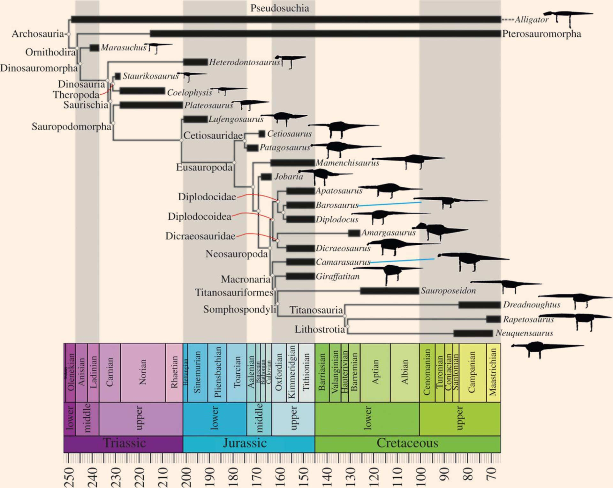

### Theropoda
**Theropoda** is a group of bipedal, primarily carnivorous dinosaurs that includes the famous *Tyrannosaurus rex*, as well as modern birds. They are the only group of dinosaurs to have living descendants today in birds.

The fossil record of theropods tends to be poor or rare, because theropods were predators for most of their history; by nature, there are always fewer predators than prey in a food chain. Additionally, most theropods had delicate skeletons that were likely to break apart prior to fossilization.

Theropods are defined by hollow bones and the development of the **furcula** (the wishbone, formed by the fusion of the clavicles). 

Against popular opinion, hollow bones did not develop as an adapation for flight, because they originated before flight. While birds are theropods and have hollow bones, these hollow bones are a plesiomorphic trait that originated within Theropoda prior to flying dinosaurs.

> Birds are classified as so: Dinosauria > Saurischia > Theropoda > Tetanurae > Coelurosauria > Maniraptora > Avialae > Aves

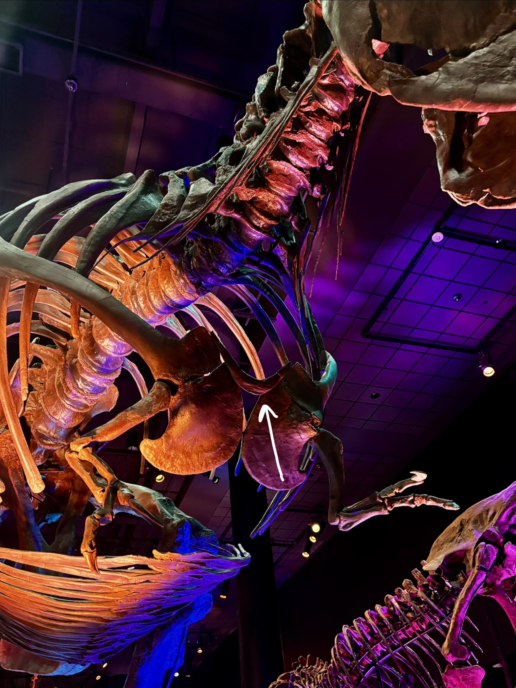

#### Ceratosauria
The deepest split within Theropoda is that between **Ceratosauria** and **Tetanurae**, the latter of which includes birds.

Ceratosauria is the earliest group of theropod dinosaurs, and is defined as all dinosaurs who share a more recent common ancestor with *Ceratosaurus* than with birds. 

While not a defining feature, ceratosaurs often possess elaborate crests and horns on their skull.

A famous example of a ceratosaur is *Dilophosaurus*. *Dilophosaurus* is poorly represented in media - it was featured in Jurassic Park as having intricate neck skin flaps and being able to spit venom, when there is no evidence for this.

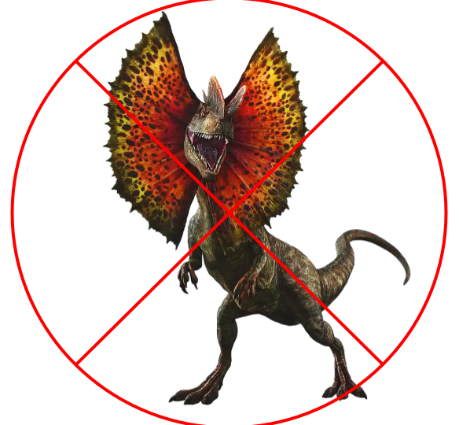{width=80%}

Another example is *Carnotaurus*.

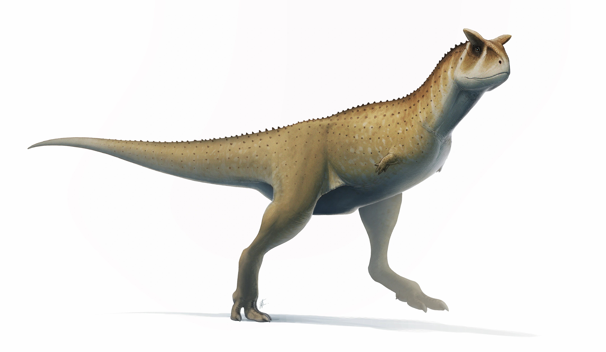

#### Tetanurae
**Tetanurae** is the group that contains the majority of predatory dinosaur diversity and most theropod dinosaurs, and is defined as the group of dinosaurs more closely related to birds than to *Ceratosaurus*.

The two defining characteristics of tetanurans are a 3-digited hand (loss of the 4th digit), and a tooth row that ends before the orbit, not extending beyond the front edge of the **orbital fenestra**. This change to the tooth row is related to bite force - the tooth row stopping before the orbit directs more pressure and force to the front of the jaw, resulting in an overall stronger bite force that is beneficial to large predators.

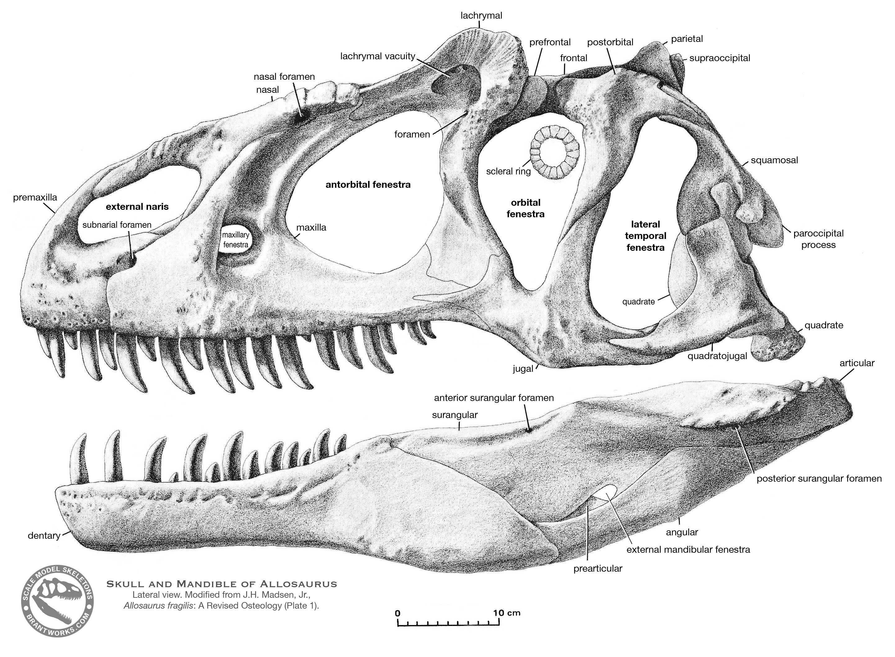

Tetanurae includes many groups of large carnivores, such as **Spinosauridae**, **Carnosauria** (not to be confused with *Carnotaurus*), and **Tyrannosauridae**. Note that these are all separate lineages, despite their similarities in being large carnivores - this is an example of convergent evolution.

**Spinosauridae** is the clade of tetanuran theropod dinosaurs that includes the famed *Spinosaurus*. Spinosaurids were large, bipedal carnivores who had long, low, and narrow crocodilian-like skulls with conical teeth. In many species, the neural spines of the vertebrae were elongated to form a sail on the animal's back.

*Spinosaurus* (a genus within Spinosauridae) is among the largest known terrestrial predators in the fossil record, having reached lengths of up to 14 meters.

The spinosaurid lifestyle was unique in that they were at least partially **piscivorous** (fish-eating); their tooth shape is consistent with that of a fish diet. They are also known to have fed on other dinosaurs and pterosaurs.

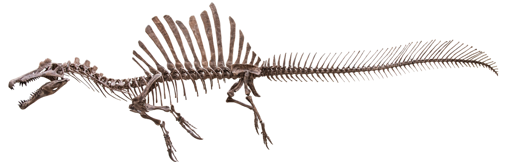

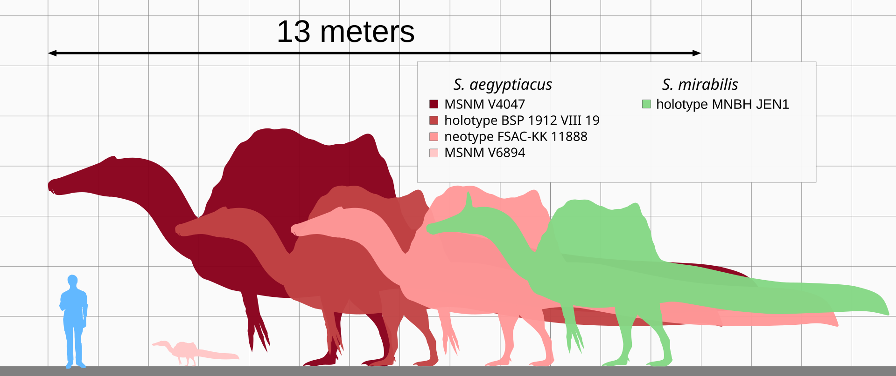

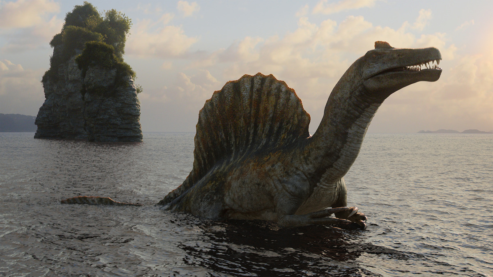

**Carnosauria**, literally translating to "meat-eating lizards," is another group of carnivorous tetanurans that includes the well-known *Allosaurus*. Carnosauria also encompasses the **Carcharodontosauridae** family, which contains some of the largest land predators ever known in *Giganotosaurus* and *Carcharodontosaurus*, who rivaled *Tyrannosaurus* in size.

Carnosaurs are known for having large eye sockets and a long, narrow skull.

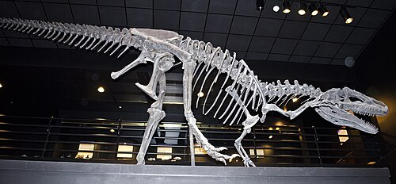

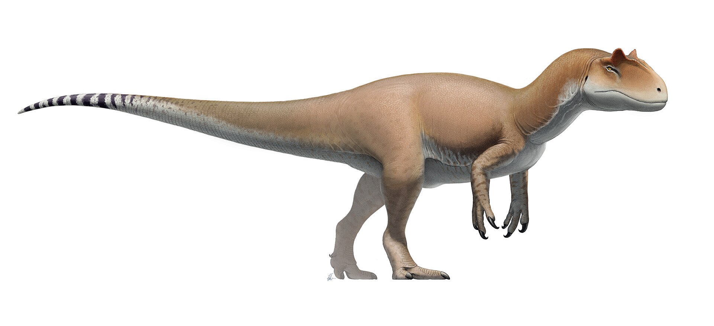

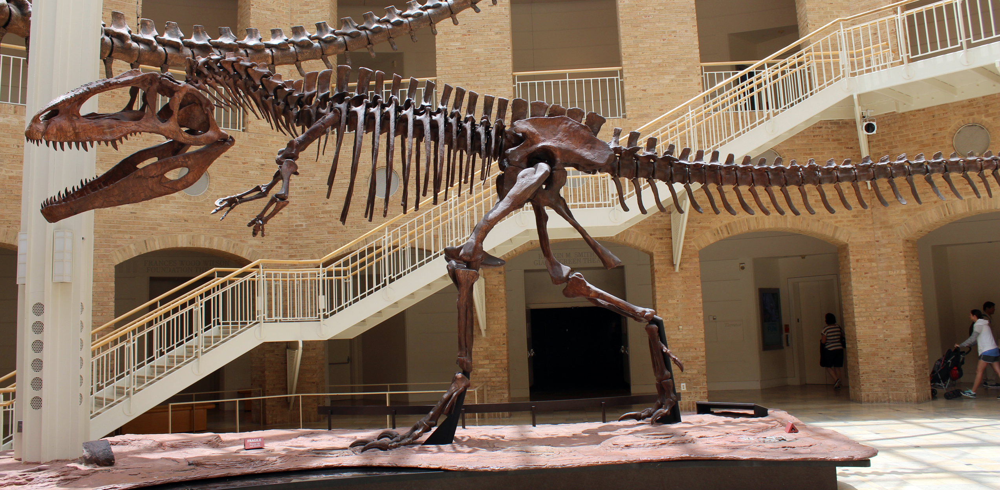

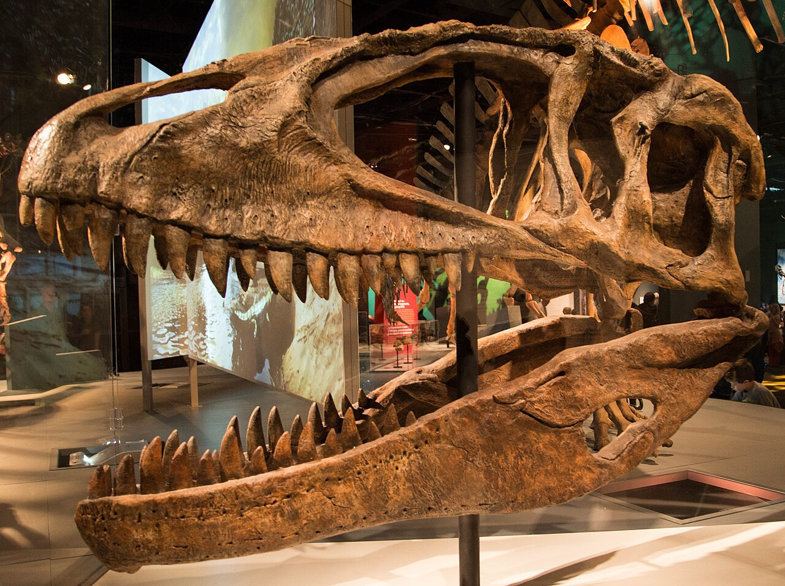

Carcharodontosaurids and Spinosaurids were the largest predators in the Early and Middle Cretaceous.

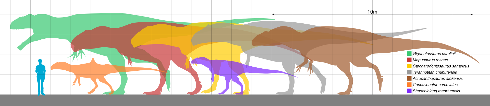

**Tyrannosauridae** is the family of theropod dinosaurs that contains the renowned *Tyrannosaurus rex*. Specifically, Tyrannosauridae is included within the clade **Coelurosauria**, which is defined as the group of all dinosaurs more closely-related to birds than to carnosaurs.

Tyrannosaurids lived near the end of the Cretaceous, and were at the apex of the food chain in their respective ecosystems. They had long legs optimized for fast movement, but very small arms with only two functional digits. Unlike many other dinosaur groups, the remains of most known tyrannosaurids are very complete, which has allowed for extensive research into their lifestyle and anatomy.

There is some debate as to whether *Tyrannosaurus* and other tyrannosaurids could have had "proto-feather" filaments. This hypothesis was further ignited by the discovery of the species *Yutyrannus huali*, a large **tyrannosauroid** (more basal or primitive members of **Tyrannosauroidea**, which contains Tyrannosauridae as well as more basal relatives) with feathers.

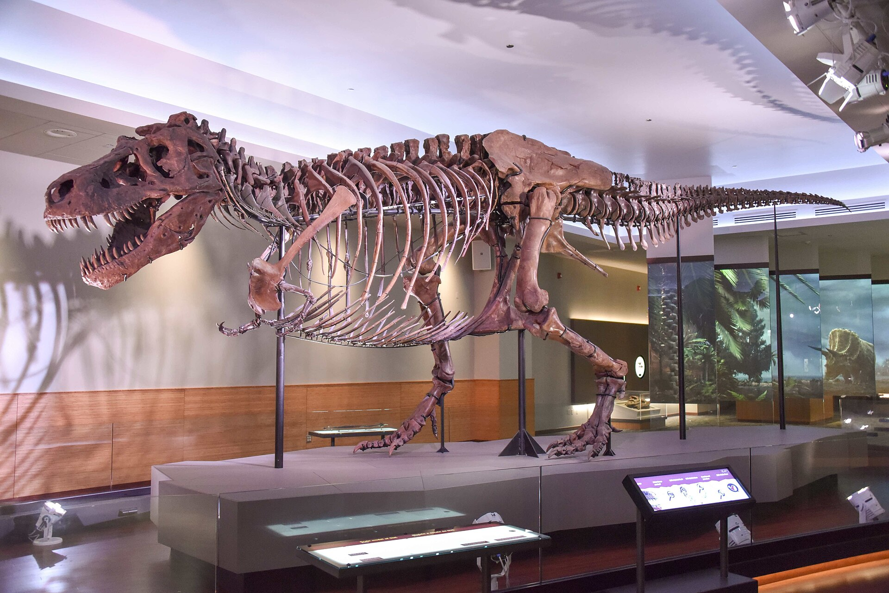

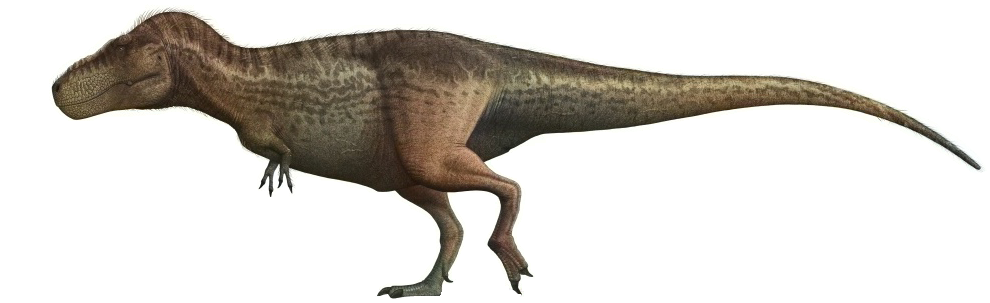

