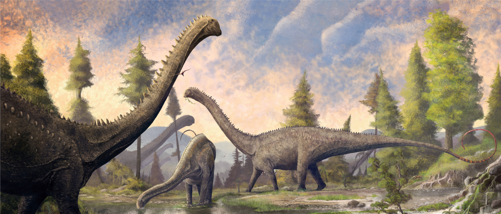
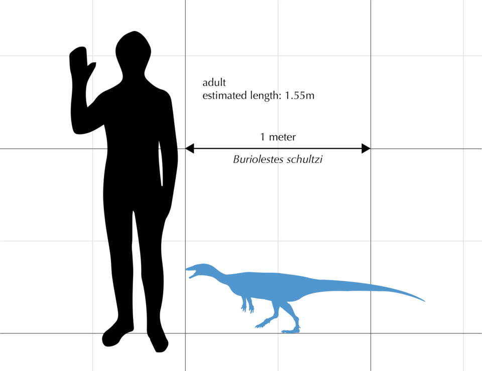
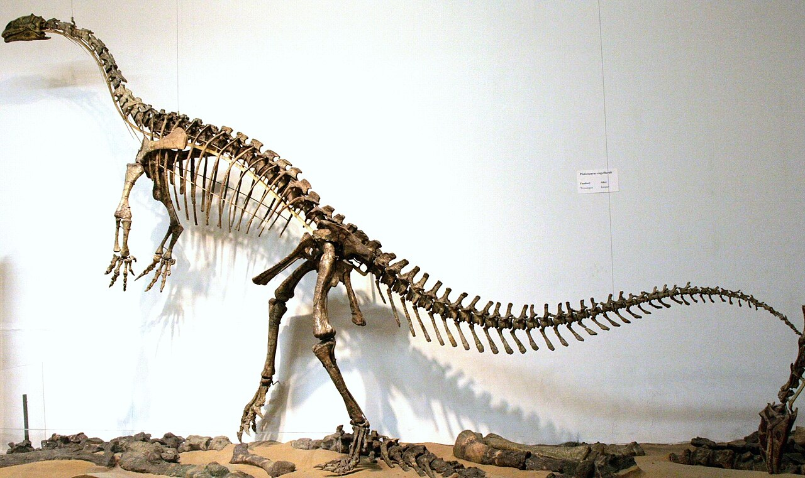
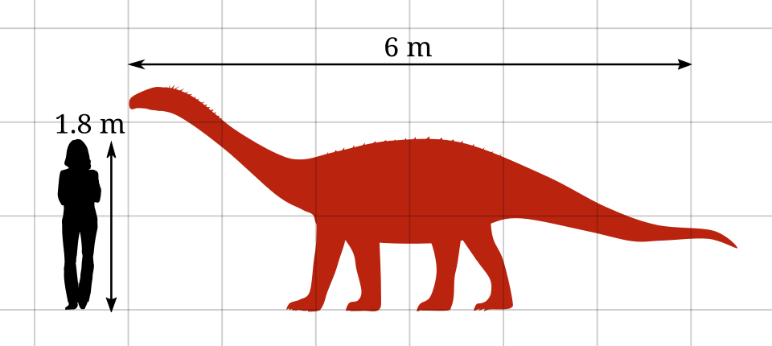

## Introduction
Sauropods are members of the saurischian clade Sauropoda. They are best known for having attained enormous sizes - Sauropoda includes the largest animals to have ever lived on land. Morphologically, sauropods are known for having very long necks, long tails, small heads (relative to the rest of their body), and four thick, pillar-like legs. 

Well known genera are *Alamosaurus*, *Dreadnoughtus*, *Brachiosaurus*, *Diplodocus*, and *Argentinosaurus*.

## What defines a Sauropod?
Sauropods are contained in Sauropodomorpha, which is one of two major clades within Saurischia. The group originated around the Late Triassic, and survived until the end of the Cretaceous. 

### Sauropodomorpha
Sauropodomorpha includes all sauropods, as well as their ancestral relatives. While sauropods were quadrupedal and herbivorous, the earlier, more basal sauropodomorphs (often called prosauropods) maintained the plesiomorphic mode of bipedal locomotion, and sometimes showed evidence of omnivorous or carnivorous diets. Over time, sauropodomorphs saw a shift to herbivorous diets, and larger body sizes supported by quadrupedal locomotion. The resulting sauropods became the largest land animals of all time.

The earliest and most primitive sauropodomorphs were small (1-2 meters long) and bipedal. Classic examples of such primitive sauropodomorphs are *Saturnalia* and *Buriolestes*. 

Throughout the Triassic Period, sauropodomorphs gradually increased in size, leading to genera such as *Plateosaurus*, who could reach lengths of 7-8m. 

These larger sizes were enabled by the evolution of obligatory quadrupedalism, and in particular, the development of columnar limbs, which evolved sometime in the Early Jurassic. It is said that *Vulcanodon* is the oldest-known sauropod to have had columnar limbs.

