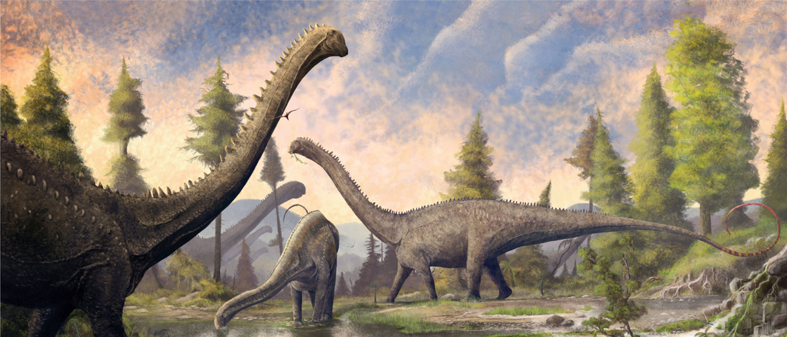
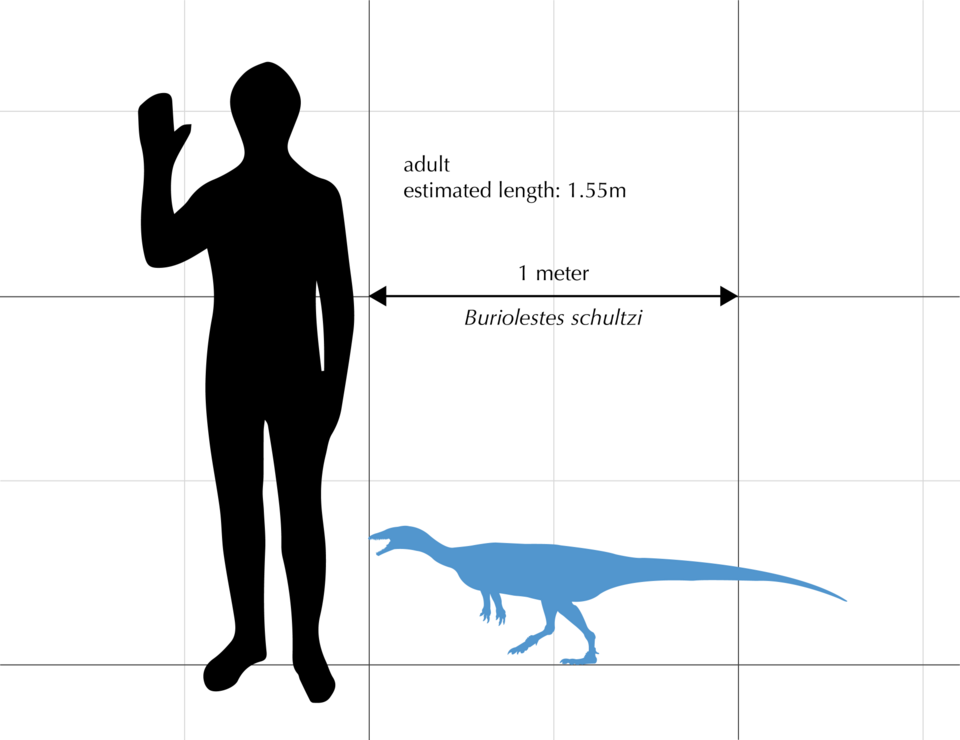
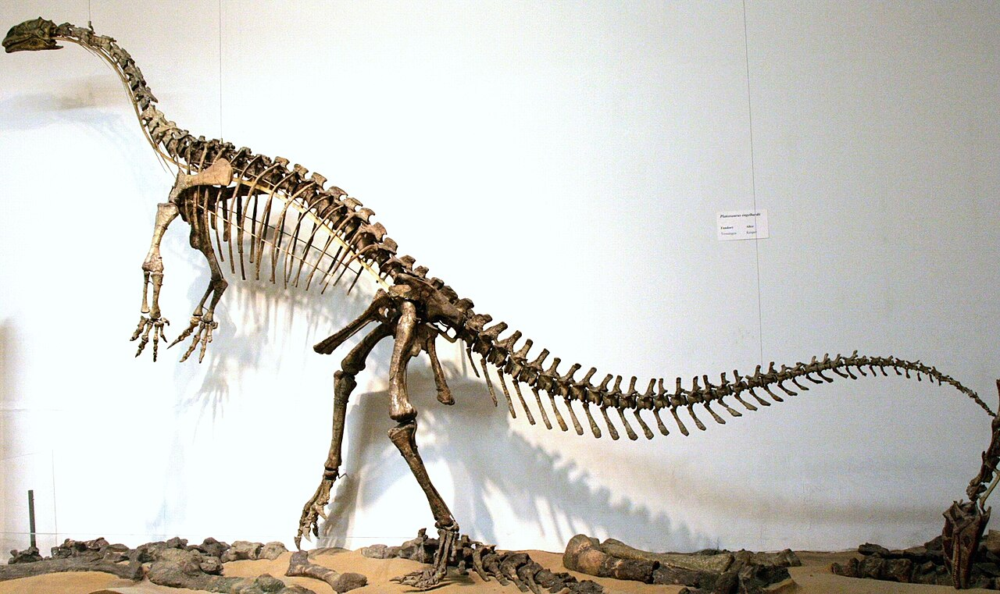
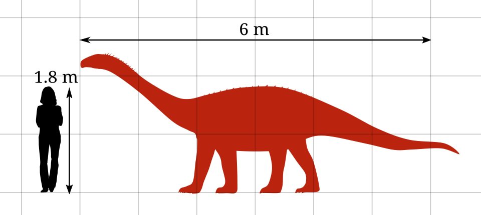
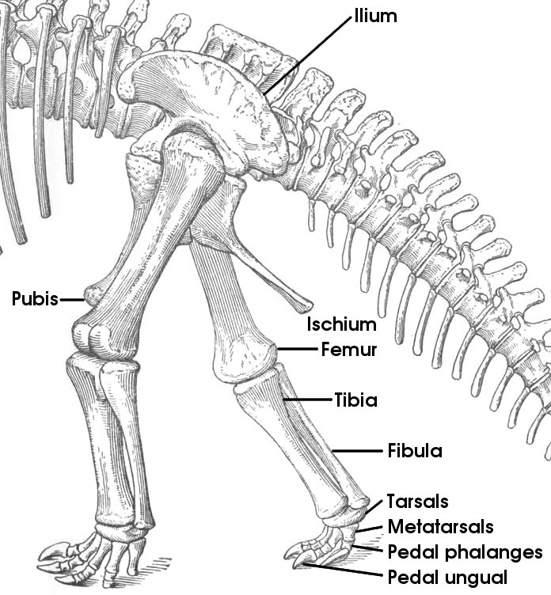
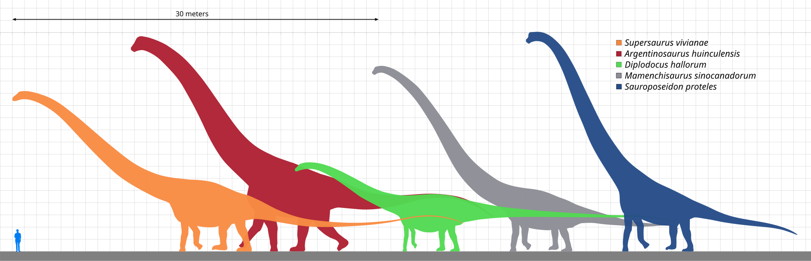

## Introduction
Sauropods are members of the saurischian clade Sauropoda. They are best known for having attained enormous sizes - Sauropoda includes the largest animals to have ever lived on land. Morphologically, sauropods are known for having very long necks, long tails, small heads (relative to the rest of their body), and four thick, pillar-like legs. 

Well-known genera are *Alamosaurus*, *Dreadnoughtus*, *Brachiosaurus*, *Diplodocus*, and *Argentinosaurus*.

## What defines a Sauropod?
Sauropods are contained in Sauropodomorpha, which is one of two major clades within Saurischia. The group originated around the Late Triassic, and survived until the end of the Cretaceous. 

### Sauropodomorpha
Sauropodomorpha includes all sauropods, as well as their ancestral relatives. While sauropods were quadrupedal and herbivorous, the earlier, more basal sauropodomorphs (often called prosauropods) maintained the plesiomorphic mode of bipedal locomotion, and sometimes showed evidence of omnivorous or carnivorous diets. Over time, sauropodomorphs saw a shift to herbivorous diets, and larger body sizes supported by quadrupedal locomotion. The resulting sauropods became the largest land animals of all time.

The earliest and most primitive sauropodomorphs were small (1-2 meters long) and bipedal. Classic examples of such primitive sauropodomorphs are *Saturnalia* and *Buriolestes*. 

Throughout the Triassic Period, sauropodomorphs gradually increased in size, leading to genera such as *Plateosaurus*, who could reach lengths of 7-8m. 

These larger sizes were enabled by the evolution of obligatory quadrupedalism, and in particular, the development of columnar limbs, which evolved sometime in the Early Jurassic. It is said that *Vulcanodon* is the oldest-known sauropod to have had columnar limbs.

The synapomorphies of Sauropodomorpha include blunt teeth (adaptations for herbivory), and a long neck with a small head. Both sauropodomorphs (and hence sauropods) and ornithischians are herbivorous, as a result of convergent evolution. However, sauropodomorphs never evolved the complex, efficient grinding teeth that ornithischians possessed; rather, they used gastroliths (stomach stones) to mechanically break down plant material in their system.

### Sauropoda
Sauropodomorphs eventually diversified and increased in size. From basal sauropodomorphs such as *Plateosaurus* arose members of Sauropoda, which includes the largest terrestrial animals of all time.

The synapomorphies of Saurpoda are an extremely long neck, an enlarged, upward-shifted external naris, and columnar limbs with a reduced number of phalanges.

.](bBrachiosaurus_Skull_Diagram.svg)

The sheer size of sauropods, relative to today's extant land animals, is mind-boggling. The largest and heaviest land animals today are elephants, who generally weigh around 5-6 tons. The biggest sauropods - members of the group Titanosauria - were estimated to have weighed upwards of 50 tons (more than a Boeing 737). In fact, when the first sauropod fossil bones were discovered in the 1820s, scientists believed they were from a whale, the only animal they knew could get so large.

The size of sauropods may seem biologically unfathomable - many factors are required in order for animals to become extremely large. First, they need to eat a lot of food. It is estimated that large sauropods likely needed to consume around 100 pounds of leaves, stems, and twigs every day. Second, they need to grow fast. Taking too long to grow to a large size would result in numerous opportunities to be attacked by a predator. Finally, they need to be able to breathe very efficiently. This provides them with sufficient oxygen to power all the metabolic reactions in their colossal bodies. Sauropods must have been able to do all of the above.

The extremely long necks of sauropods - perhaps their most distinctive feature - was an adaptive advantage that enabled them to eat the large amounts of food necessary to put on excessive weight. A longer-than-usual neck started evolving in the earliest prosauropods in the Triassic, and continued getting even longer in the later sauropods. This allowed sauropods to reach higher up in trees, giving them access to a new source of food.

Sauropods also grew rapidly. A key synapomorphy of dinosaurs is their faster growth rates relative to other ancient amphibians and reptiles. Studies suggest that most sauropods grew rapidly, maturing from guinea-pig-sized hatchlings to airplane-sized adults in only about 30-40 years.

Finally, sauropods had highly efficient lungs, similar to that of birds. Mammals (including humans) have bi-directional lungs, where air flows in and out through the same path. Birds have a unidirectional lung, where oxygen is extracted during both inhalation and exhalation; each new breath bringing in new air also pushes old air out. 